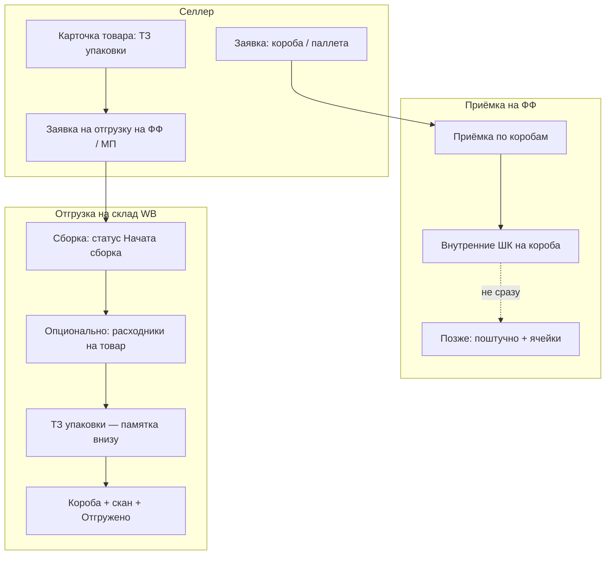

# User stories продукта (встреча с заказчиком + уточнения)

Документ фиксирует **пользовательские истории** по целевому процессу WMS: что делают селлер и сотрудники фулфилмента, что видят в интерфейсе, какие ограничения и что **сознательно не делаем** в ближайших срезах.

**Связанные документы**

- Целевой процесс (бизнес-язык): [`BUSINESS_PROCESS_SELLER_INBOUND_OUTBOUND_RU.md`](BUSINESS_PROCESS_SELLER_INBOUND_OUTBOUND_RU.md)
- Ограничения MVP: [`MVP_DECISIONS_RU.md`](MVP_DECISIONS_RU.md)
- Терминология (поставка vs отгрузка на МП): раздел «Терминология» в `MVP_DECISIONS_RU.md`
- Реализовано сейчас vs разрывы: [`ACTUAL_BACKLOG_RU.md`](ACTUAL_BACKLOG_RU.md)

**Легенда статуса (для планирования)**

| Метка | Смысл |
|--------|--------|
| **Сделано** | Есть в продукте и покрыто поведением/тестами (см. `IMPLEMENTED_PRODUCT_SCENARIOS_RU.md`) |
| **Частично** | Часть сценария есть, не хватает правил, UI или побочных эффектов (остатки, обязательность полей) |
| **Запланировано** | Согласовано с заказчиком, в коде существенно нет |
| **Вне среза** | Осознанно не делаем в обозримом MVP |

**Формат ID:** `US-<блок>-<номер>` (блок = буква эпика в документе).

---

## Решения после встречи (зафиксировать в планировании)

1. **Отдельный этап «упаковка» в жизненном цикле поставки не вводим** — нет статусов «упакован / не упакован», нет отдельного рабочего места упаковщика между приёмкой и отгрузкой.
2. **После приёмки по коробам поштучную приёмку сразу не делаем** — на принятые короба клеят **внутренние штрихкоды**, чтобы позже, при поштучной приёмке, идентифицировать содержимое.
3. **Инвентаризация не блокирует** движения по складу (мягкая сверка, без жёсткой блокировки ячеек).
4. **Расходники** — та же заявка на поставку/приёмка, отличие только в **номенклатуре** (тип «расходник»); приходуются, отображаются на остатках, списываются как товар.
5. **ТЗ на упаковку товара** — заполняет **селлер в карточке товара**; обязательно перед отправкой заявки на отгрузку на ФФ; при **сборке отгрузки на склад WB** сотрудник ФФ видит инструкции в **раскрывающемся блоке** внизу экрана (по каждому товару в отгрузке).
6. **Расходники при сборке отгрузки на МП** — на статусе «Начата сборка» можно (не обязательно) указать расходники с остатка **того же селлера**; при проведении отгрузки система **сохраняет расчёт** расхода (кол-во в отгрузке × норма на 1 шт.).

---

## Схема процесса (актуальная)

---

## A. Заявка на поставку (селлер → ФФ)

| ID | Статус | User story |
|----|--------|------------|
| **US-A-01** | Частично | **Как селлер**, я хочу создать заявку на **поставку** с указанием **ожидаемого количества коробов** (поле «Коробов (план)» в черновике; тип паллеты — позже). |
| **US-A-02** | Запланировано | **Как селлер**, при **более 10 коробов** без паллетирования я хочу видеть **предупреждение**, что желательно/обязательно паллетирование, чтобы согласовать с ФФ до приезда. |
| **US-A-03** | Частично | **Как селлер**, я хочу добавить в поставку **товары** и **расходники** (одна заявка, разная номенклатура), чтобы всё приехало одним документом. |
| **US-A-04** | Запланировано | **Как приёмщик ФФ**, я хочу открыть заявку с **планом по коробам** и начать приёмку **с этапа «по коробам»**, а не с поштучного ввода. |

---

## B. Приёмка по коробам и внутренние штрихкоды

| ID | Статус | User story |
|----|--------|------------|
| **US-B-01** | Частично | **Как приёмщик**, я принимаю поставку **по количеству коробов** (план селлера vs факт на ФФ, кнопка «Принято по коробам»); поштучный пересчёт — отдельный этап после. |
| **US-B-02** | **Сделано (MVP)** | После «Принято по коробам» система создаёт N коробов с внутренним ШК `INB-…`; на ФФ — таблица коробов и **Печать** / **Печать всех** (CODE128, как этикетки ячеек); отметка «Напечатано». Поштучная приёмка по скану короба — **US-C-01**. |
| **US-B-03** | Частично | **Как приёмщик**, при план ≠ факт по коробам вижу **предупреждение** на экране приёмки (`boxes_discrepancy`). |
| **US-B-04** | Вне среза | ~~Отдельный этап «упаковка» между коробами и поштучной приёмкой~~ — **не делаем**. |
| **US-B-05** | Запланировано | **Как оператор**, я хочу использовать **единый размер короба 60×40×40** без выбора из справочника размеров, чтобы упростить приёмку и отгрузку. |

---

## C. Поштучная приёмка, ячейки, остатки

| ID | Статус | User story |
|----|--------|------------|
| **US-C-01** | **Сделано (MVP)** | **Как приёмщик**, **позже** (когда дошли до короба по внутреннему ШК) я хочу **поштучно** принять товар и **разложить по ячейкам**, чтобы остаток был привязан к адресу. |
| **US-C-02** | **Сделано (MVP)** | **Как приёмщик**, при раскладке я хочу, чтобы система **подсказывала ячейки, где уже лежит этот товар**, чтобы класть в то же место. |
| **US-C-03** | **Сделано (MVP)** | **Как приёмщик**, при назначении ячейки я хочу **напечатать штрихкод ячейки**, чтобы наклеить и сканировать при следующих операциях. |
| **US-C-04** | **Сделано (MVP)** | **Как приёмщик**, я хочу видеть строку **зелёным**, если поштучный факт **совпал с ожидаемым**, чтобы сразу понимать «всё ок». |
| **US-C-05** | **Сделано (MVP)** | **Как кладовщик**, я хочу видеть **остаток без ячейки** выделенным **отдельным цветом**, чтобы сразу видеть «ещё не разложено». |
| **US-C-06** | **Сделано (MVP)** | **Как приёмщик**, я хочу **найти товар по штрихкоду** и добавить строку в приёмку (FF: поле «Добавить по ШК», picker Enter; v2: поиск по WB-ШК в каталоге). |
| **US-C-07** | Запланировано | **Как приёмщик**, я хочу **распечатать накладную / документ приёмки**, сверить количества **на бумаге** с фактом, затем внести подтверждённые данные в систему. |

---

## D. Расхождения и акты

| ID | Статус | User story |
|----|--------|------------|
| **US-D-01** | Частично | **Как приёмщик / селлер**, при расхождении я хочу оформить **акт расхождений с причиной** (брак, недостача, пересорт и т.д.). |
| **US-D-02** | Запланировано | **Как пользователь**, я хочу **сильнее визуально выделять** расхождения на экране приёмки, чтобы их нельзя было пропустить. |
| **US-D-03** | Запланировано | **Как селлер / ФФ**, я хочу **акт корректировки (±)** с **подтверждением второй стороны**, после которого меняется остаток (см. целевой процесс). |

---

## E. Склад: линии, ячейки, список товаров

| ID | Статус | User story |
|----|--------|------------|
| **US-E-01** | Запланировано | **Как админ склада**, я хочу заводить **линии** (ряды/зоны) и **привязывать к ним ячейки**, а не держать плоский список кодов. |
| **US-E-02** | Запланировано | **Как админ**, я хочу, чтобы система **последовательно генерировала коды ячеек** в рамках линии (*правило нумерации — уточнить при проектировании*). |
| **US-E-03** | Запланировано | **Как кладовщик**, в **списке товаров** я хочу сразу видеть **ячейки**, где лежит SKU, без лишних переходов. |
| **US-E-04** | Запланировано | **Как кладовщик**, я хочу экран **наполнения склада** с блоком **«Без ячейки»** (отдельное визуальное выделение). |

---

## F. Расходники (номенклатура и остатки)

| ID | Статус | User story |
|----|--------|------------|
| **US-F-01** | Запланировано | **Как админ / селлер**, я хочу завести номенклатуру типа **«расходник»** (этикетки, пакеты, скотч и т.д.) в **той же заявке на поставку**, что и товар. |
| **US-F-02** | Запланировано | **Как приёмщик**, я хочу **оприходовать расходники на склад** тем же потоком приёмки, чтобы они были на остатках ФФ. |
| **US-F-03** | Запланировано | **Как кладовщик**, я хочу **видеть остатки расходников** по селлеру и **списывать** их при отгрузке (см. блок G). |

---

## G. Отгрузка на склад WB (сборка, ТЗ, расходники)

*В UI: отгрузка на маркетплейс; в системе может называться технически иначе. Не путать с **поставкой** (селлер → ФФ).*

### G.1 ТЗ на упаковку в карточке товара (селлер)

| ID | Статус | User story |
|----|--------|------------|
| **US-G-01** | Запланировано | **Как селлер**, в **карточке товара** я хочу заполнить **ТЗ на упаковку** (сколько наклеек, нужен ли ЧЗ, тип пакета, прочие указания), чтобы ФФ собирал заказ по моим правилам. |
| **US-G-02** | Запланировано | **Как селлер**, я **не могу отправить заявку на отгрузку на ФФ**, пока у **каждого товара** в заявке **не заполнено ТЗ на упаковку** (валидация при submit). |

### G.2 Памятка при сборке (сотрудник ФФ)

| ID | Статус | User story |
|----|--------|------------|
| **US-G-03** | Запланировано | **Как сотрудник ФФ**, при **сборке отгрузки на склад WB** я хочу внизу экрана видеть **раскрывающийся блок «ТЗ на упаковку»** с инструкцией **по каждому товару** в отгрузке. |
| **US-G-04** | Запланировано | **Как сотрудник ФФ**, если в отгрузке **несколько товаров**, в блоке должны быть **отдельные инструкции на каждый товар** (не одна общая строка). |

### G.3 Статус «Начата сборка» и расходники (опционально)

| ID | Статус | User story |
|----|--------|------------|
| **US-G-05** | Запланировано | **Как сотрудник ФФ**, я хочу перевести отгрузку в статус **«Начата сборка»**, чтобы зафиксировать начало комплектации перед отгрузкой. |
| **US-G-06** | Запланировано | **Как сотрудник ФФ**, в статусе «Начата сборка» я хочу для **каждого товара** указать **расходники со склада** — только **расходники того селлера**, чей это товар. |
| **US-G-07** | Запланировано | **Как сотрудник ФФ**, для **этикеток** я хочу указать **количество** (общие стандартные этикетки); для **остальных расходников** — формат **«сколько штук на 1 товар»**. |
| **US-G-08** | Запланировано | **Как сотрудник ФФ**, я могу **пропустить** шаг выбора расходников — он **не обязателен** для проведения отгрузки. |
| **US-G-09** | Запланировано | **Как система**, при **проведении отгрузки** я хочу **рассчитать и сохранить** фактический расход упаковочных материалов: **количество товара в отгрузке × норма расходника на 1 шт.** (по введённым сотрудником значениям). |

### G.4 Короба, сканирование, списание остатков

| ID | Статус | User story |
|----|--------|------------|
| **US-G-10** | Частично | **Как сотрудник ФФ**, я хочу собирать отгрузку **по коробам** стандартного размера **60×40×40**, **сканировать** штрихкоды и наращивать факт по строкам. |
| **US-G-11** | Частично | **Как сотрудник ФФ**, при финальном статусе **«Отгружено»** остатки товаров **должны списаться** со склада (движения остатков). |
| **US-G-12** | Запланировано | **Как сотрудник ФФ**, после отгрузки я хочу **внутренние штрихкоды на короба** отгрузки (генерация/печать), чтобы идентифицировать короба на дальнейших этапах (*уточнение: на приёмке — ШК при приёмке коробов; на отгрузке — ШК коробов отгрузки*). |
| **US-G-13** | Запланировано | **Как сотрудник ФФ**, я хочу **печатать документ отгрузки / накладную** для сверки перед вывозом. |

---

## H. Печать штрихкодов и этикеток

| ID | Статус | User story |
|----|--------|------------|
| **US-H-01** | Сделано | **Как админ**, я хочу печатать **штрихкод ячейки** (термо 58×40). |
| **US-H-02** | Запланировано | **Как оператор**, я хочу **настраивать размер печати** ШК (короб, товар, ячейка), в т.ч. **крупнее**, под принтер и ленту. |
| **US-H-03** | Запланировано | **Как оператор**, я хочу печатать **внутренние ШК коробов** (приёмка и/или отгрузка) в выбранном размере. |

---

## I. Инвентаризация

| ID | Статус | User story |
|----|--------|------------|
| **US-I-01** | Запланировано | **Как кладовщик**, я хочу провести **инвентаризацию по клиенту (селлеру)** — сверка всех его позиций. |
| **US-I-02** | Запланировано | **Как кладовщик**, я хочу провести **инвентаризацию по адресам (ячейкам)**. |
| **US-I-03** | Запланировано | **Как кладовщик**, инвентаризация **не блокирует** приёмку, отгрузку и перемещения по складу (несовпадения фиксируются отдельно). |

---

## J. Честный знак (ЧЗ)

| ID | Статус | User story |
|----|--------|------------|
| **US-J-01** | Частично | **Как оператор**, я хочу раздел **Честный знак** в кабинете ФФ (*сейчас заглушка*). |
| **US-J-02** | Запланировано | **Как оператор / селлер**, я хочу загружать данные ЧЗ **из Excel** или через **интеграцию ЧЗ**. |
| **US-J-03** | Запланировано | **Как селлер**, в **ТЗ на упаковку** я хочу явно указывать, **нужен ли ЧЗ** на товар при отгрузке. |

---

## K. Кабинет селлера и заявки (сквозные)

| ID | Статус | User story |
|----|--------|------------|
| **US-K-01** | Частично | **Как селлер**, я хочу единый список **заявок** (поставка, отгрузка, акты) с фильтром по типу и ключевыми колонками. |
| **US-K-02** | Сделано | **Как селлер**, я хочу создавать **черновики поставки и отгрузки** и видеть **остатки** по своим товарам. |
| **US-K-03** | Запланировано | **Как селлер**, я хочу видеть **доступный остаток** (с учётом резерва), когда планирую отгрузку. |

---

## L. Аккаунты, роли, аудит

| ID | Статус | User story |
|----|--------|------------|
| **US-L-01** | Сделано | **Как владелец ФФ**, я хочу регистрацию организации, вход и изоляцию данных по тенанту. |
| **US-L-02** | Сделано | **Как селлер**, я вижу только свои данные; не могу выполнять действия «только ФФ». |
| **US-L-03** | Запланировано | **Как менеджер**, я хочу **историю в документе** (кто/когда менял статус и вводил факт). |

---

## Дефекты и быстрые правки (из встречи)

| ID | Тип | Описание |
|----|-----|----------|
| **BUG-01** | Баг | При приёмке **не работает поиск по штрихкоду**, товар **не добавляется** в заявку. |
| **BUG-02** | UX | Расхождения при приёмке — сделать **заметнее** (связано с US-D-02). |

---

## Сводная таблица: приоритет для нарезки issues

| Приоритет | ID (ключевые) | Тема |
|-----------|----------------|------|
| **P0** | ~~US-G-11~~, US-D-03 | ~~Списание остатков при отгрузке на МП~~ (**сделано** в срезе 2026-05-22); акт корректировки |
| **P0** | US-B-01, US-B-02 | Приёмка по коробам + внутренние ШК на короба (без сразу поштучно) |
| **P0** | US-G-01, US-G-02, US-G-03, US-G-04 | ТЗ упаковки в карточке товара + блок при сборке отгрузки |
| **P1** | US-G-05 … US-G-09 | Статус «Начата сборка», опциональные расходники, расчёт при проведении |
| **P1** | US-C-02 … US-C-05, US-E-03, US-E-04 | Ячейки, подсказки, цвета, «без ячейки» |
| **P1** | US-F-01 … US-F-03 | Расходники как номенклатура |
| **P2** | US-E-01, US-E-02 | Линии и автогенерация ячеек |
| **P2** | US-I-01 … US-I-03 | Инвентаризация (не блокирует) |
| **P2** | US-J-02, US-H-02 | ЧЗ Excel/API, размер печати ШК |

---

## Что не входит (явно)

- Отдельный workflow **«упаковка»** между приёмкой и отгрузкой (статусы упакован/не упакован, повторный пересчёт на станции упаковки).
- Создание поставок/карточек **в WB** из продукта (см. `MVP_DECISIONS_RU.md`).
- Биллинг литр‑день, НДС — отдельные эпики.

---

*Документ обновлять при новых встречах с заказчиком; при появлении `TC-Sxx` / `TC-NEW` в issues ссылаться на ID `US-*` из этой таблицы.*
