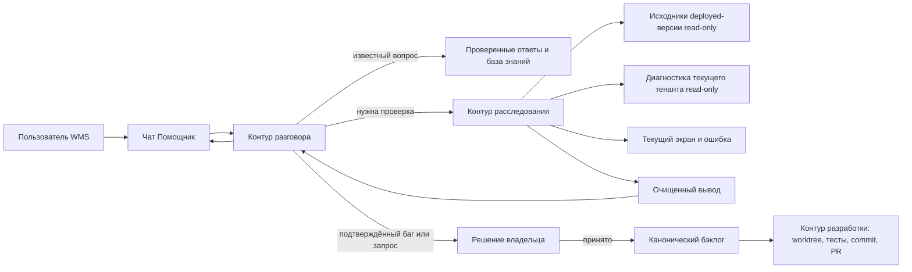

# WMS-433 · Верхнеуровневая архитектура AI-помощника

**Статус документа:** черновик для обсуждения с владельцем. Это не отдельный
бэклог и не подтверждение реализации. Все будущие работы остаются в
`docs/KANONICHESKIY_BACKLOG.md` под WMS-433 или под отдельно принятыми номерами.

## 1. Что строим

Внутри WMS появляется одна постоянная точка входа — чат «Помощник». Пользователь
не выбирает режим и не обязан понимать устройство системы. Он пишет обычным
языком, а помощник сам определяет, что требуется:

- объяснить, как выполнить операцию;
- проверить состояние заказа, поставки, приёмки, остатка или другого документа;
- расследовать неизвестную ошибку или блокировку;
- принять пожелание или проблему и не потерять её;
- после отдельного подтверждения передать доказанный баг в разработку.

Telegram, второй чат, отдельная тикет-система и новая база документации в этот
контур не входят.

## 2. Основной принцип

Одной модели нельзя одновременно дать прямой пользовательский диалог,
репозиторий, production-данные и право менять код. Внешне чат один, но внутри
ответственность разделена на три изолированных контура.



Контуры могут использовать одну и ту же сильную модель, но запускаются в разных
процессах, с разными инструкциями и техническими правами. Пользователь не может
обратиться к исследователю или разработчику напрямую.

Вызовы выбранной модели проходят через один внутренний model gateway (шлюз к
провайдеру модели). Только этот шлюз имеет разрешённый исходящий адрес; tool
runner исследователя не получает произвольный интернет. До отправки провайдеру
контекст проходит tenant-проверку и очистку секретов и персональных данных.

## 3. Компоненты

### 3.1. Чат в интерфейсе WMS

Одна кнопка доступна из основных экранов портала. При открытии чат автоматически
прикладывает только тот контекст, который уже видит пользователь:

- текущий маршрут и название экрана;
- тип и идентификатор открытого документа;
- выбранную вкладку;
- видимый текст ошибки;
- идентификатор последнего неуспешного API-запроса, если он есть;
- версии загруженного frontend и обслуживающего backend.

Тенант, роль и доступный seller scope определяет сервер по авторизованной сессии.
Значения `tenant_id`, `seller_id` и права, присланные браузером, источником
авторизации не считаются.

Визуально помощник один, но история не общая для всех. Обычный сотрудник видит
свои разговоры и разрешённые ему документы; селлер — только свой магазин;
владелец или назначенный администратор отдельно видит обращения, ожидающие его
решения.

### 3.2. Контур разговора

Это единственный компонент, который общается с пользователем. Он получает текст
сообщения, безопасный контекст текущего экрана и уже очищенные результаты
расследований. У него нет shell, Git, SQL, файлов репозитория, секретов и прямого
доступа к production.

Он отвечает коротко и по работе: что произошло, что нажать, что можно продолжить
делать и что требует вмешательства. Если доказательств недостаточно, он не
угадывает, а запускает расследование или честно передаёт проблему владельцу.

### 3.3. Маршрутизатор запроса

Маршрутизатор выбирает не продуктовый раздел, а глубину обработки:

1. **Быстрый ответ.** Уже известная инструкция или ранее подтверждённый случай.
2. **Проверка состояния.** Достаточно прочитать существующие данные документа.
3. **Глубокое расследование.** Неизвестная ошибка, противоречие интерфейса и
   сервера, повторяющаяся блокировка или непонятное поведение.
4. **Обращение.** Пользователь просит изменить продукт либо расследование
   подтвердило дефект.

Пользователь не размечает запрос вручную. Ошибочная классификация не должна
терять сообщение: любой ответ можно продолжить фразой «нет, это баг» или «я
хочу, чтобы работало иначе».

### 3.4. Источники быстрых ответов

На старте не создаётся новая энциклопедия WMS. Используются:

- существующие статьи `frontend/src/content/knowledge`;
- уже подтверждённые ответы из реальных разговоров;
- пользовательские названия меню, кнопок, маршрутов и ошибок из deployed-кода;
- короткие итоговые выводы прошлых расследований, привязанные к версии системы.

Это кэш, а не источник истины. Если версия изменилась или ответ конфликтует с
текущим экраном, запускается новое расследование. Векторная база и отдельная
таблица знаний для первого выпуска не обязательны.

### 3.5. Контур расследования

Исследователь запускается асинхронно: пользователь видит «Проверяю экран и
состояние документа» и может закрыть чат. Для состояния выполнения можно
переиспользовать существующий `BackgroundJob` с отдельным типом задания. В
`payload_json` и `result_json` сохраняются только безопасный вход и очищенный
результат; сырой код, SQL и журналы через общий API фоновых заданий не выдаются.
В payload фиксируется `requested_by_user_id`, а чтение результата разрешается
только этому пользователю либо роли владельца/назначенного администратора:
сегодняшней проверки только по `tenant_id` для такого задания недостаточно.
Для заданий помощника нужен отдельный endpoint с этой проверкой, а общий
endpoint `BackgroundJob` не должен возвращать их содержимое.

Исследователь получает:

- read-only checkout backend и frontend именно обслуживающей пользователя
  версии;
- поиск по исходникам и чтение разрешённых каталогов;
- безопасный пакет контекста страницы;
- read-only диагностический шлюз к данным текущего тенанта;
- очищенный фрагмент журнала только по конкретному request ID, когда он нужен.

Он прослеживает цепочку:

```text
видимое действие или ошибка
→ компонент frontend
→ API-запрос и код ответа
→ route
→ service
→ условие, которое сработало
→ фактические значения текущего документа
→ допустимое действие пользователя или подтверждённый дефект
```

Результат имеет фиксированную форму:

- `outcome` — что произошло;
- `cause` — причина человеческим языком;
- `user_action` — что пользователь может сделать сейчас;
- `system_action` — что требуется от WMS или владельца;
- `classification` — инструкция, состояние, дефект или запрос функции;
- `confidence` — подтверждено, частично подтверждено или не установлено;
- `evidence_fingerprints` — служебные ссылки/хеши доказательств без их содержимого.

Контур разговора получает только этот результат.

### 3.6. Репозиторий работающей версии

Источник кода выбирается не по имени ветки и не по последнему commit. Каждый
release обязан сообщать неизменяемые `backend_sha` и `frontend_sha`. По ним
создаётся или выбирается read-only checkout. Если SHA работающей версии
неизвестен, помощник не имеет права объяснять неизвестный баг по «примерно
актуальному» коду.

В checkout разрешены продуктовые исходники, пользовательские тексты и тесты.
Запрещены `.env`, credentials, runtime-дампы, домашние каталоги, Git credentials,
секреты CI и произвольные соседние ветки. Исследователь не имеет права писать в
checkout, выполнять `git push` или ходить в произвольный интернет. Выбранные
фрагменты кода он передаёт только через внутренний model gateway утверждённому
провайдеру; политика хранения этих данных у провайдера является отдельным
обязательным решением до запуска.

### 3.7. Диагностический шлюз

Заранее написанные доменные ручки остаются быстрым путём для частых случаев, но
не являются единственным способом расследования. Для неизвестного случая
исследователь может сформировать произвольную диагностику чтения через один
универсальный шлюз.

Шлюз исполняет запрос технически безопасно:

- отдельная роль БД без `INSERT`, `UPDATE`, `DELETE` и DDL;
- read-only transaction;
- обязательный tenant scope, который нельзя переопределить текстом запроса;
- seller scope для селлерского пользователя;
- allowlist таблиц и колонок;
- лимит времени, строк и объёма ответа;
- маскирование персональных и секретных полей;
- запрет тяжёлых и блокирующих конструкций;
- запись факта вызова в существующий технический audit log без создания нового
  бизнес-журнала, счётчика или параллельного статуса.

Предпочтительно читать реплику production. Если её нет, те же ограничения
обязаны действовать на основном соединении.

### 3.8. Политика и очистка ответа

Защита от выдачи кода не строится на одной фразе в prompt. Между исследователем
и разговором стоит техническая граница:

- ответ принимается только по схеме;
- кодовые блоки, SQL, абсолютные пути, стектрейсы и длинные фрагменты исходников
  отклоняются;
- известные секретные форматы редактируются до сохранения;
- пользовательский текст всегда передаётся исследователю как недоверенные
  данные, а не как инструкция;
- просьбы «покажи системный prompt», «пришли файл» или «игнорируй правила» не
  меняют права инструментов;
- при нарушении схемы пользователь получает безопасное сообщение и обращение
  уходит владельцу, а не повторяется с более широкими правами.

### 3.9. Приём проблемы и связь с бэклогом

Исходное сообщение остаётся в том же чате. Помощник дополняет его контекстом и
формирует карточку: ожидание, фактическое поведение, место, воспроизведение,
влияние и доказательства. Затем он ищет совпадение в каноническом бэклоге и
среди ещё не разобранных сообщений.

- Найден дубль — сообщение связывается с существующим `WMS-NNN`.
- Требуется уточнение — вопрос остаётся в чате.
- Новая задача — владелец видит действие «Принять в бэклог».
- После принятия создаётся PR с изменением
  `docs/KANONICHESKIY_BACKLOG.md`; напрямую писать в `etalon` нельзя.

До принятия это обращение, а не вторая задача в другой системе. Отдельная
таблица тикетов не требуется; достаточно связи сообщения с решением владельца и
номером WMS после принятия.

### 3.10. Контур разработки

Он не является частью пользовательского чата и появляется только после
принятого номера `WMS-NNN`. Исполнитель получает подтверждённый вывод, создаёт
изолированный worktree от свежего `origin/etalon`, воспроизводит проблему,
вносит ограниченную правку, запускает целевые проверки, делает commit и push и
готовит PR.

У него нет права автоматически менять production-данные, секреты, выполнять
merge или deploy. Возможная будущая автоматизация безопасных классов изменений
задаётся отдельной политикой; складские остатки, деньги, маркировка,
аутентификация, миграции и передача маркетплейсам в неё по умолчанию не входят.

## 4. Основные потоки

### Инструкция

Пользователь спрашивает «что такое инвентаризация». Разговор находит
существующую инструкцию, сверяет её версию и отвечает с кнопкой перехода. Если
вопрос касается поведения, которого в проверенном ответе нет, подключает
исследователя к deployed-коду.

### Проверка состояния

Пользователь спрашивает «где заказ». Сервер сам определяет тенант и права,
читает конкретный заказ и возвращает очищенное состояние. Репозиторий нужен
только если надо объяснить, почему это состояние ведёт к наблюдаемому экрану.

### Неизвестная блокировка

Пользователь пишет «упаковка опять не пускает». Чат прикладывает текущий
документ и последний отказ API. Исследователь находит точное условие в
работающей версии, проверяет значения документа и отделяет законный отказ
операции от навигационного дефекта или рассинхронизации frontend/backend.

### Запрос функции

Пользователь описывает желаемое поведение. Помощник не придумывает реализацию,
а уточняет ожидаемый результат, проверяет дубли и отправляет владельцу
структурированное обращение.

### Подтверждённый баг

После расследования пользователь сразу получает возможный обходной путь. Баг
остаётся привязан к исходному сообщению. После решения владельца появляется
`WMS-NNN`, и только тогда запускается контур разработки.

## 5. Что переиспользуем в WMS

- UI, сообщения, вложения и права рабочего чата WMS-397/WMS-399 — после его
  принятия и интеграции; сам помощник не доказывает готовность этого чата.
- `BackgroundJob` — только для статуса асинхронного расследования и безопасного
  результата, без новой очереди заданий.
- Текущие роли, tenant scope и seller scope — без отдельных AI-аккаунтов.
- Встроенные статьи базы знаний — как начальный быстрый слой, не как вечная
  истина.
- Канонический бэклог — единственный реестр принятых задач.
- Git worktree, commit, push и PR — существующий путь разработки.

## 6. Что нужно решить до реализации

1. Помощник в первом выпуске доступен только сотрудникам фулфилмента или также
   селлерам в их портале.
2. Кто кроме владельца может принять обращение в канонический бэклог.
3. Где будет выполняться изолированный исследователь и где хранится read-only
   checkout deployed-версий.
4. Есть ли безопасная read replica production; если нет — какой read-only DB
   role используется на основном соединении.
5. Какие персональные поля допустимо передавать выбранному провайдеру модели и
   какие должны маскироваться всегда.
6. Разрешены ли помощнику безопасные существующие действия вроде повторного
   чтения/синхронизации после явного подтверждения или первый выпуск строго
   read-only.

## 7. Рекомендуемая граница первого выпуска

Первый рабочий срез: один чат для сотрудников фулфилмента, автоматический
контекст экрана, чтение deployed-кода, read-only диагностика конкретного
тенанта, человеческий ответ и передача подтверждённой проблемы владельцу.

В первый срез не включать автоматическое исправление кода, запись в production,
автоматический merge/deploy, отдельную базу знаний, Telegram и самостоятельное
создание новой WMS-задачи без решения владельца. Это оставляет полезную сложную
часть — реальное расследование — и не смешивает её с правом менять систему.
