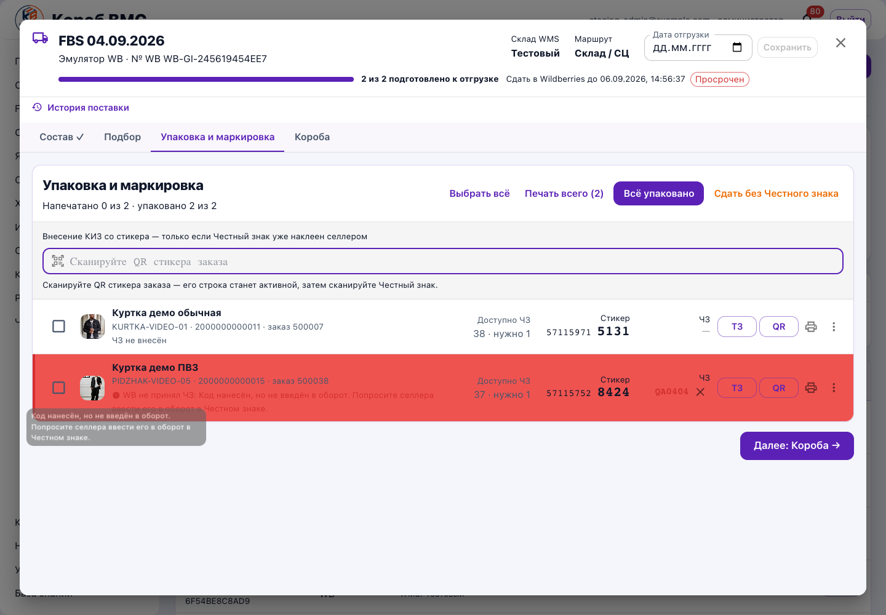
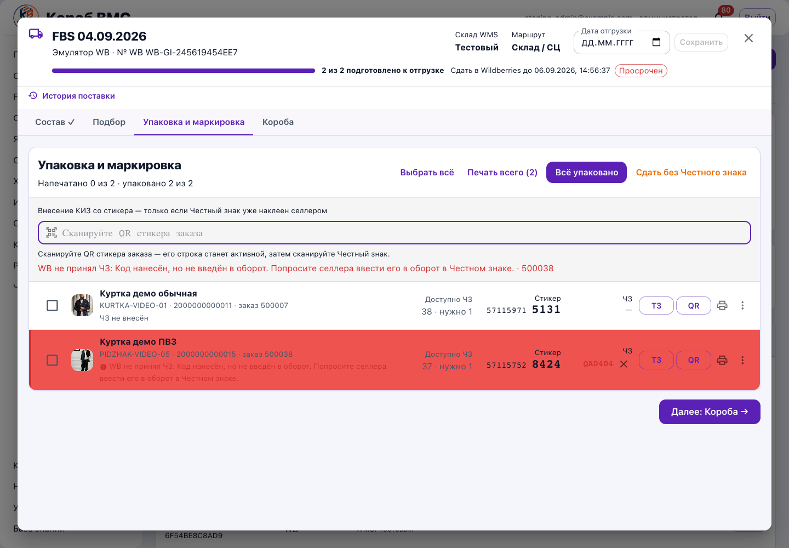

# WMS-394 / WMS-395 / WMS-403 / WMS-404: точечная правка сканирования и отмены ЧЗ

Дата: 09.09.2026. Ветка `codex/wms394-kiz-ui`, база `054897e2` (`origin/etalon`).

## Изменение

Восстановлен исходный сброс выделенного заказа из `2ef9c0d3` (исторический ошибочный WMS-392, теперь WMS-403): кнопка «Сбросить» и Escape очищают активный заказ, введённое значение, ошибку и подсказки, затем возвращают фокус сканеру. Ту же операцию вызывает повторный скан активного стикера (WMS-394). Сравнение использует правило существующего `fbs_kiz_service.sticker_scan_candidates`: пробельные символы/BOM и преобразование русской раскладки. Регистр латинского стикера сохраняется. Сброс не выполняет HTTP и складских операций. У обработанного Escape остановлено всплытие события: дополнительный браузерный сценарий выявил, что иначе Escape может закрыть внешний диалог поставки; после исправления окно остаётся открытым.

Применено ранее существовавшее условие из `01fa60e2`: отклонённый операторский КИЗ тоже доступен для отмены. Рядом с хвостом кода добавлен маленький крестик, открывающий прежний диалог подтверждения. Используются прежние DELETE и перечитывание рабочего пространства. Сервер уже вызывает поиск с `include_rejected=True`, поэтому серверный код не изменён.

Существующая красная строка и перевод вердикта WB сохранены. У статуса появился значок ошибки с доступной по наведению/фокусу подсказкой. После сохранения скана результат определяется из уже выполняемого перечитывания рабочего пространства: отрицательный вердикт показывается в панели скана вместе с переведённой причиной и номером заказа. Успешное сохранение не подменяет подтверждение WB.

Исходные `d76e53c4` и `86bdc748` проверены: это постановки в каноническом бэклоге, реализации в них нет. Новых таблиц, журналов, блокировок или складских эффектов не добавлено. Навигация по вкладкам и оформление строк сохранены.

## Техническая проверка

- `npx tsc --noEmit -p tsconfig.app.json` — успешно.
- `npm run test:unit -- src/screens/v2/fbsUx.test.ts` — 16 passed; в том числе нормализация стикера, обратная раскладка, различение другого заказа/ЧЗ/регистра/пунктуации и существующая проверка перевода WB.
- `npm run build` — успешно, только предупреждение Vite о размере существующих крупных chunks.
- Зависимости использованы через ссылку на существующий `frontend/node_modules`; установка пакетов и тяжёлые локальные сборки Android не выполнялись.

## Ручные действия в браузере: настоящий staging, локально изменённый frontend

Отдельный headless Google Chrome, реальная страница `/ff/fbs`, локальный Vite на `127.0.0.1:5197` с proxy на staging API. Существующая авторизация прочитана только в память; значения не сохранялись и не выводились. Снимок сессии не сохранялся, временный профиль удаляется при закрытии браузера.

Открыта разрешённая учебная поставка `4e38cabf-b129-4a28-85b0-3dd3631da6a4` / `WB-GI-245619454EE7`, заказ 500038, селлер «Эмулятор WB». Настоящие GET рабочего пространства, задания упаковки и поиска стикера. Любая неперехваченная операция записи в браузере заблокирована; таких попыток не было.

На настоящих данных staging последовательно нажаты:

1. Стикер `*DU7aq2hE`, затем повтор в русской раскладке с BOM/пробелами: выделение исчезло, фокус и пустое поле восстановлены, при самом сбросе HTTP отсутствует.
2. Повторный выбор заказа, Escape: тот же результат, ноль HTTP при сбросе.
3. Повторный выбор заказа, «Сбросить»: тот же результат, ноль HTTP при сбросе.
4. Переход к коробам и назад на упаковку: вкладки доступны.

Это проверка действий браузера с существующим учебным заказом. Реальная запись/отмена ЧЗ и запросы изменения WB не выполнялись; складские количества в БД этим запуском не сверялись.

## Контролируемые ответы: отмена и отрицательный вердикт

В том же настоящем интерфейсе ответы рабочего пространства, поиска/валидации/сохранения и DELETE подменены только в отдельном браузере. Использован синтетический хвост `QA0404`. Эти результаты не являются проверкой реального удаления в WB или работы серверной отмены.

- У отклонённого операторского кода видны красная строка, крестик и значок; наведение показывает перевод `sgtinApplied` — код не введён в оборот.
- «Не отменять» закрывает подтверждение без DELETE.
- Подтверждение вызывает ровно один перехваченный DELETE; ответ 204 и перечитывание удаляют код с экрана.
- При перехваченном 503 код остаётся; экран показывает человеческую ошибку Wildberries.
- Успешный ответ сохранения с последующим отрицательным статусом в перечитывании немедленно показывает у сканера «WB не принял ЧЗ» с переведённой причиной; строка красная.
- После перехваченной ошибки формата ЧЗ отдельно нажаты «Сбросить» и Escape: выделение/ошибка исчезают, поставка остаётся открытой, фокус возвращается; новых запросов скана или записи нет. Фоновые GET общего приложения при этой проверке не считаются действиями сброса.
- Ошибок JavaScript на странице не зафиксировано.

## Граница выпуска

Это отдельная опубликованная ветка изменений интерфейса. Общий CI, итоговый Opus, интеграция в staging и production выполняются основной задачей. Новый frontend на staging/production этим отчётом не объявляется выложенным. Финальная проверка реальной отмены разрешённого тестового кода после интеграции остаётся основной задаче.
