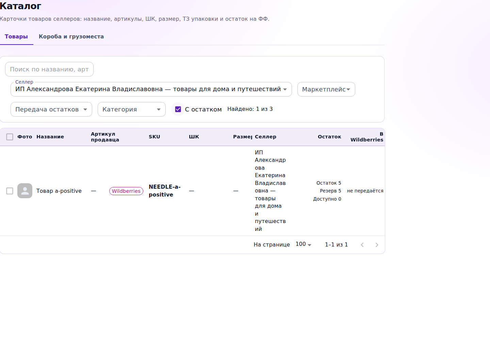
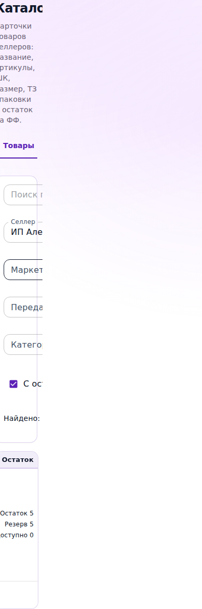

# WMS-667: удалённая визуальная проверка для C10

06.10.2026. Это результат отдельного Sol 6.1 тестировщика, не заключение
аналитика и не изменение приёмки. **На широком окне проверка проходит;
в окне 390 px читаемость нарушена.** Ожидания сохранены, продукт не исправлялся.

## Точность источника и выполненного запуска

Продуктовый SHA: `2d139aee43464ff799fe64d1cbf05b043ff88007`.
Проверенный полный source checkout: `c4142888f32830c0138cf221987affcbd3f2ac7e`.
Фронт и backend побитово совпадают с продуктовым SHA; отличия до c414 — документы.
Для сравнения исходного дизайна отдельно получен предшествующий реализации
контрактный SHA `463b03825dec5fdca43a39c117e7afc4080c0508`.
В runner оба exact SHA проверены самим адаптером через git rev-parse.

Проба сохранена и опубликована в отдельной ветке `codex/wms667-visual-runner`,
коммит запуска `a59f308ee8d7c10de52d44a2a6de6650e6aeb9bd`.
[Фактический GitHub run 37434785697](https://github.com/chivkunovd-bitdenis/WMS/actions/runs/37434785697)
завершён с failure: четыре сценария прошли, два узких сценария упали на
измеренном выходе фильтров за границы окна, а не на импорте или ожидании элемента.
Chromium `141.0.7390.37`, Ubuntu 24.04, Playwright 1.56.1. Все шесть сценариев
реально выполнены последовательно. Ни одного pageerror не зарегистрировано.

Использован настоящий FfProductsCatalogScreen, React, MUI и muiTheme, index.css
и ui.css из каждого exact checkout. Это безопасная синтетическая страница
компонента на временном Vite сервера GitHub runner; полноценная оболочка
AuthedAppLayout и авторизованный стенд не запускались. Внешняя сеть из браузера
заблокирована. Только GET к подменённым API, никакой живой БД/маркетплейса.
Запросов за пределы runner origin не возникло.

[Полный архив изображений, HTML, измерений и журналов](https://github.com/chivkunovd-bitdenis/WMS/actions/runs/37434785697/artifacts/11398099959)
загружен actions/upload-artifact. Retention — 14 дней; основные PNG и полный
[report.json](artifacts/wms667-visual-runner/report.json) дополнительно сохранены
в Git, поэтому доказательство не зависит только от срока жизни архива.

## Наблюдения по исходному C10 и дополнительной защите контекста

| Фактически выполненный сценарий | Результат |
|---|---|
| Исходный дизайн 1440×1000, длинный селлер | PASS: фильтры читаемы, прямоугольники не пересекаются |
| Исходный дизайн 390×1000, тот же селлер | FAIL: элементы фильтров шириной 741.4 px выходят за окно |
| Кандидат 1440×1000, длинный селлер, «С остатком» | PASS: один положительный товар, Остаток 5 / Резерв 5 / Доступно 0; фильтры не пересекаются |
| Кандидат 390×1000, те же данные | FAIL: элементы шириной 741.4 px; экран и надписи обрезаны |
| Поздний ответ каталога A после переключения к Б | PASS: остаётся только b-positive, Остаток 7 / Резерв 9 / Доступно −2 |
| Поздняя сводка остатков A после переключения к Б | PASS: данные A не заменяют строку/остаток Б; checkbox остаётся в новом выборе |

Длинное имя фикстуры: «ИП Александрова Екатерина Владиславовна — товары для дома
и путешествий». У A также есть нулевой товар, исключённый включённым отбором;
положительный полностью зарезервированный товар остаётся. Широкое изображение
и текст настоящего компонента сопоставлены с заданными quantity/reserved/available.
Нового SQL/API прогона нет: их ранее успешные контракты и CI не повторялись.

В узком сценарии у кандидата ширина самого фильтрующего блока 82 px,
то есть `390 - 308`; его дочерние контролы сохраняют 741.4 px. В коде экрана
уже до WMS-667 есть `maxWidth: 'calc(100vw - 308px)'`, а у фильтра селлера
minWidth без ограничения длинного выбранного значения. Это объясняет
наблюдаемую геометрию, но не является внедрённым исправлением или новым
продуктовым требованием. Та же проблема у baseline подтверждает, что
добавление «С остатком» не создало её впервые. Это не разрешает объявить
текущую узкую читаемость исправленной.

Пересечений прямоугольников фильтров не обнаружено во всех шести случаях.
Однако отсутствие пересечений само по себе не делает обрезанные надписи
читаемыми. Изображения вручную осмотрены после получения настоящих runner PNG:
на широком окне нужная колонка читается, на узком видна лишь часть экрана.

Исходные [baseline-1440.png](artifacts/wms667-visual-runner/baseline-1440.png)
и [baseline-390.png](artifacts/wms667-visual-runner/baseline-390.png) также сохранены.

## Передача аналитику и ведущему

Требования, frozen backend/DOM тесты, продукт и документ приёмки не менялись.
Тестировщик не заполняет C10 и не подменяет вердикт исходного/заменяющего аналитика.
Передаются реальное широкое визуальное подтверждение, измеренное нарушение
читаемости на 390 px и точная граница синтетической страницы без полной оболочки.
Решение о приёмке C10 и необходимом дальнейшем исправлении принимает аналитик
в существующем процессе. Переименование failure в PASS или ослабление окна
для зелёного результата не выполнялись; неизменённый продукт не повторялся.

[CI 37429703534 PR #381](https://github.com/chivkunovd-bitdenis/WMS/actions/runs/37429703534)
перечитан: success на точном c4142888. Полный CI повторно не запускался.
Отдельная ветка пробы не создаёт нового PR и не изменяет PR #381.
Локальные проверки адаптера: node --check и git diff --check — PASS.
Mac Chrome/браузер, skills, секреты, Telegram, runtime, production/staging writes,
merge и деплой не использовались. Для WMS сохраняется единый выпуск ведущего.
