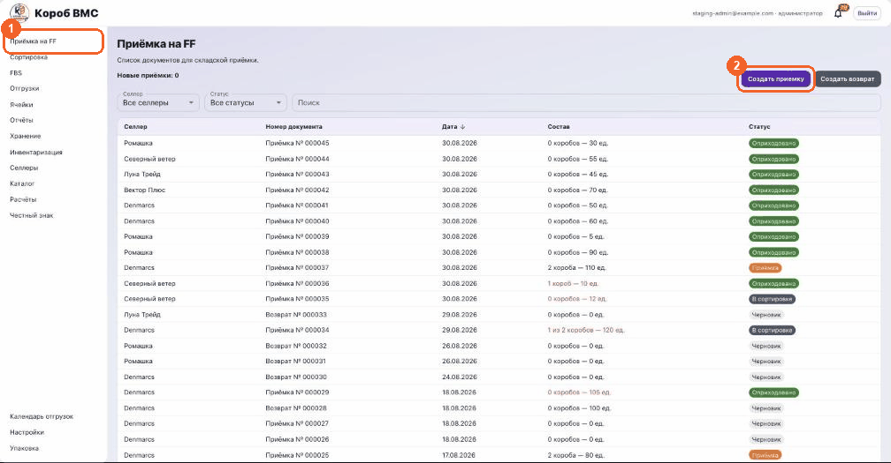

## Зачем это нужно

Приёмка — это момент, когда товар селлера физически заезжает на наш склад и впервые появляется в системе. Всё, что будет дальше — хранение, сборка заказов, отгрузка на маркетплейс, расчёты с селлером — считается от тех цифр, которые вы вбили здесь. Пока приёмка не завершена, товара для системы не существует: его нельзя ни разложить по ячейкам, ни зарезервировать под заказ.

Если принять криво, ошибка не останется внутри документа. Не отсканировали десять штук — они не появятся на остатке, и через неделю заказ уедет в недостачу, а виноватым окажется склад. Наоборот, отсканировали лишнее — система будет обещать маркетплейсу товар, которого на полке нет. Поэтому в приёмке считают по факту, штука за штукой, а расхождение с тем, что заявил селлер, честно фиксируют в документе, а не «подгоняют» под план.

## Порядок действий

1. Откройте в левом меню пункт **«Приёмка на FF»**. Это очередь документов приёмки: колонки «Селлер», «Номер документа», «Дата», «Состав» и «Статус». Над таблицей — счётчик «Новые приёмки», в него попадают документы в статусе «Передано на склад», то есть те, что селлер уже отправил, а склад ещё не тронул.
2. Найдите нужный документ. Сверху есть фильтры «Селлер» и «Статус» и поле «Поиск» — оно ищет сразу по номеру документа, номеру накладной, названию селлера и названиям товаров. Нажмите на строку, документ откроется.
3. Если селлер заявку не заводил и машина приехала «просто так», нажмите **«Создать приёмку»**. В окне выберите «Селлер» и нажмите **«Создать»** — документ создастся и сразу откроется. Соседняя кнопка **«Создать возврат»** — это другой процесс: возврат товара с маркетплейса, там дополнительно спрашивают «Маркетплейс».
4. В новом документе (статус **«Черновик»**) наберите состав. Кнопка **«Добавить товар»** открывает окно «Выбор товаров» с каталогом селлера: ищите по артикулу, ШК (штрихкоду), артикулу WB, артикулу продавца или названию, проставьте количество в колонке «Кол-во в заявку» и нажмите **«Добавить в заявку»**. В черновике работает и сканер: отсканируйте ШК товара, и строка добавится сама.
5. Проверьте габариты товара — иконка линейки в колонке «Габариты». В окне «Габариты товара» заполняются «Длина, мм», «Ширина, мм», «Высота, мм» и «Вес, г». Это не бюрократия: из габаритов в шапке документа считаются «Литраж» и «Вес» всего принятого, а хранение тарифицируется по литр-дню — то есть по объёму, который товар занимает на складе.
6. Перед разбором машины удобно распечатать бумагу: кнопка **«Печать накладной»** выдаёт «Лист приёмки» на A4 — фото, товар, ШК, колонка «Заявлено» и пустая колонка «Факт» под ручной пересчёт.
7. Нажмите **«Начать приёмку»**. Статус документа станет «Приёмка», и с этого момента экран слушает сканер: штрихкод можно бить не целясь в поле ввода, система сама поймает пачку символов.
8. Разверните блок **«Короба и грузоместа»** и заведите тару. Кнопка **«Создать короба»** создаёт один короб за одно нажатие — нужно пять коробов, нажмите пять раз. Кнопка **«Создать грузоместа»** открывает окно, где в поле «Количество грузомест» указывают число от 1 до 1000, и по нажатию **«Создать»** заводятся сразу все. У каждой единицы тары появляется свой номер и внутренний штрихкод — по нему её потом и находят.
9. Напечатайте и наклейте этикетки. У каждого короба и грузоместа есть кнопка **«Печать»**, а для всех сразу — **«Печать коробов»** и **«Печать грузомест»**. В окне печати выбирается физический размер этикетки (по умолчанию 58×40 мм), затем **«Печать»**. У грузоместа, на которое этикетку уже печатали, появляется отметка «Этикетка напечатана».
10. Наполните тару товаром. Нажмите **«Наполнить»** у нужного короба — откроется окно «Наполнить короб» (у грузоместа — «Наполнить грузоместо») с полем «Штрихкод товара» и кнопкой **«Скан»**. Бейте штрихкоды подряд: каждый скан добавляет **одну** штуку в колонку «В коробе», строка подсвечивается зелёным и сама прокручивается на середину экрана, чтобы вы видели, куда ушёл скан. Если считаете пачкой, число можно вписать руками в поле «В коробе» и нажать Enter.
11. Закончив с коробом, нажмите **«Готово»**. Окно закроется, а состав короба подтянется в документ — его видно списком прямо под заголовком короба.
12. Товар, который едет не в таре, а россыпью, сканируйте прямо в документе, ничего не открывая. Каждый скан — плюс одна штука в колонку **«Принято»**. В шапке рядом всегда видно «Принято: сколько из скольких».
13. Если посчитали руками, нажмите карандаш в колонке «Принято», введите целое число и нажмите Enter. Дроби система не примет — только целые штуки.
14. Товар, которого в документе нет вообще, добавляйте кнопкой **«Добавить товар»** уже во время приёмки. Такая строка помечается «Добавлено ФФ» и приходит с планом 0 — то есть сразу считается излишком, и это правильно: селлер её не заявлял.
15. Сверьте итог в шапке: «Принято: X из Y» и «Короба: …». Строки, где факт сошёлся с планом, подсвечены зелёным, где не сошёлся — красным, с подписью «Недостача N» или «Излишек N».
16. Нажмите **«Завершить приёмку»**. Если расхождения есть, система покажет окно «Есть расхождения, провести приёмку?» с таблицей по SKU («Ожидалось», «Принято», «Отклонение») и сводкой по коробам. Посмотрите на цифры ещё раз и подтвердите кнопкой **«Завершить приёмку»**.
17. После проведения статус станет **«В сортировке»**, принятый товар зачислится на склад в служебную зону «Сортировка», а короба и грузоместа переедут туда же. Дальше работа продолжается в разделе **«Сортировка»** — там принятое раскладывают по ячейкам хранения, и только разложенное становится доступно к резерву.

> Если ошиблись и заметили это сразу, кнопка **«Редактировать»** вернёт документ обратно в приёмку. Но работает она только пока ничего из этой приёмки ещё не разложено по ячейкам — после раскладки документ уже не откроется, и исправлять придётся другими документами.

## Частые ошибки и что делать

- **«Товар не найден в документе».** Штрихкод прочитался, но такого товара в этом документе нет. В самом сообщении есть кнопка **«Добавить товар»** — она откроет каталог селлера с уже подставленным штрихкодом. Если и в каталоге товара нет, система прямо скажет «Товар не найден в каталоге селлера»: такую позицию через приёмку сейчас не провести.
- **«Товар относится к другому селлеру. В одной приёмке нельзя смешивать селлеров».** Вы бьёте чужой товар в чужой документ. Это не придирка системы: остатки и расчёты ведутся по каждому селлеру отдельно. Отложите позицию и заведите на неё отдельную приёмку.
- **Скан не срабатывает, а символы падают в поле.** Экран отличает сканер от человека по скорости: он ждёт пачку минимум из пяти символов подряд, набранных быстро, и завершающий Enter. Медленный ручной ввод сканом не считается — так и задумано. Плюс общий скан намеренно отключается, пока открыто окно наполнения короба, выбора товаров или габаритов: в окне короба сканируйте в его собственное поле «Штрихкод товара».
- **«Нельзя удалить короб с товарами».** Кнопка **«Удалить»** у короба работает только для пустого короба. Сначала откройте **«Наполнить»** и обнулите количества, потом удаляйте.
- **«Нельзя уменьшить принятое количество ниже уже размещённого».** Часть этого товара уже разложена по ячейкам, и опустить факт ниже размещённого нельзя — иначе на складе повиснет товар, которого по документам не принимали. Разбирайтесь через сортировку и остатки, а не правкой факта. Похожая, но более ранняя стадия — «Нельзя указать меньше N: товар уже разложен по коробам и грузоместам»: часть ещё не доехала до ячеек, но уже лежит в таре, и опустить факт ниже неё тоже нельзя — сначала разберите тару.
- **В документе нет кнопок «Начать приёмку» и «Завершить приёмку».** И очередь приёмок, и все действия внутри документа открывает одно и то же право — доступ-блок «Приёмка». Обычно он есть у администратора фулфилмента, но администратор может включить его в настройках и обычному сотруднику — тогда кнопки увидит и он. Если кнопок нет — это права, а не поломка: позовите того, у кого включён доступ «Приёмка» (не обязательно администратора), либо попросите администратора включить его нужному человеку.
- **Закрыли документ, а число не сохранилось.** Если вы правили «Принято» и не нажали Enter, при закрытии выскочит окно «Закрыть без сохранения?». Нажмите **«Остаться»**, сохраните число, и только потом закрывайте. Отдельная кнопка **«Сохранить»** дожимает незакрытую правку и показывает подтверждение «Документ сохранён».
