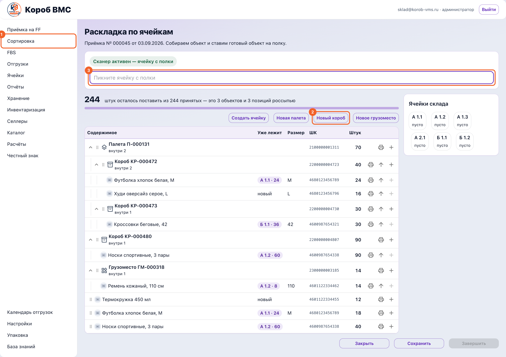
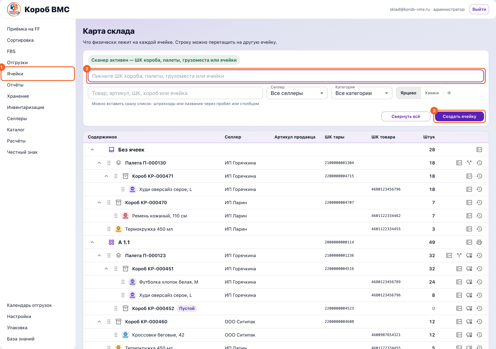

## Зачем это нужно

Когда приёмка (движение товара от селлера к нам на фулфилмент) закрыта, товар уже наш и уже числится на складе — но лежит он в служебной зоне «Сортировка». Это буфер: система знает, что триста футболок приехали, и не знает, на какой они полке. Пока ты их не разложил, на карте склада они висят одной кучей в разделе «Без ячеек», и найти их можно только глазами. Размещение — это и есть ответ на вопрос «где именно лежит эта штука», записанный в систему.

Раскладка в WMS устроена объектами, а не адресами у каждой строки товара. Товар лежит в коробе, короб стоит на палете, палета стоит в ячейке. Место самого товара нигде отдельно не хранится — оно вычисляется по цепочке держателей: посмотрели, в каком коробе товар, потом где этот короб, потом где палета. Из-за этого «что в коробе» и «где короб» физически не могут разъехаться: это одно и то же знание, записанное один раз. Практический вывод для тебя простой — переставил короб, и весь товар внутри переехал вместе с ним, ничего дополнительно отмечать не надо.

> Сначала собираем объект — товар в короб, короб на палету, — и только готовый объект ставим на полку.

## Шаг 1. Открыть документ в сортировке

Открой в левом меню пункт **«Сортировка»**. Это список документов, которые ждут раскладки: колонки «№ документа», «Селлер», «Состав», «Короба», «Осталось, шт» и «Статус». Статус «В сортировке» значит, что раскладывать ещё есть что, «Оприходовано» — что всё уже разложено.

Нажми на строку нужного документа — он откроется целиком. Если приёмку ещё не закрыли, вместо раскладки ты увидишь подсказку «Сначала завершите приёмку в разделе Приёмка»: раскладывать нечего, пока не зафиксировано, сколько именно приняли.

Внутри документа найди блок **«Раскладка по ячейкам»**. Он появляется, только если у склада включено адресное хранение (учёт остатков по ячейкам) — галка «Адресное хранение включено» в разделе «Настройки», её ставит администратор. Наверху блока крупное число и подпись вида «штук осталось поставить из … принятых — это … объектов и … позиций россыпью», а под ней полоса выполнения. «Россыпь» — это товар, который лежит сам по себе, не убранный ни в какую тару.

## Шаг 2. Убедиться, что есть куда класть

Если ячеек на складе нет, раскладывать некуда — и это первое, что стоит проверить. Нажми **«Создать ячейку»**: в окне заполняется «Стеллаж» (пиши так, как написано на самом стеллаже — А, Б, В1), «Сторона» — «Сторона 1» или «Сторона 2», и «Позиция», куда система сама подставляет первую свободную. Внизу окна показывается готовый «Код ячейки» — например `А 1.1`. Жми «Создать».

Сразу же напечатай и наклей штрихкод ячейки, иначе сканировать будет нечего. Выбери ячейку в правой колонке и нажми печать **«ШК ячейки»**; откроется «Печать стикера» с выбором размера этикетки — по умолчанию `58 × 40 мм`. Учти предупреждение «Напечатанное не отменить»: лишняя этикетка — это лишняя наклейка на стеллаже, которую потом придётся отдирать.

## Шаг 3. Собрать объект: товар в короб, короб на палету

Заведи тару, если её ещё нет: кнопки **«Новая палета»**, **«Новый короб»**, **«Новое грузоместо»**. Номер и штрихкод выдаёт сервер, сам их не придумывай — придуманные не совпадут с настоящими, и сканер такую тару не найдёт. У палеты код человекочитаемый, вида `П-000131`. У короба и грузоместа, заведённых прямо здесь, код и штрихкод — это одна и та же строка вида `WHB-7QZK3M9XCF2H8A`, без отдельного номера. Коды вида `КР-000472` и `ГМ-000318` тоже встретятся в списке — это тара, которую завели ещё на приёмке и привезли с ней в раскладку, а не то, что выдаёт кнопка создания новой тары здесь.

Сложи товар в тару. Строку товара можно перетащить мышкой на строку короба, а можно нажать плюс **«Положить в место»** — откроется окно «Куда положить» с полем «Место» и полем «Сколько штук» (подсказка «Всего … — можно переложить часть»), подтверждает кнопка «Положить». Тара переезжает целиком: «Переедет целиком, вместе со всем содержимым».

Правила вложенности складские, а не программистские, и запомнить их проще, чем кажется: товар кладётся в любую тару и на любую ячейку; короб и грузоместо — на палету или в ячейку; палета — только в ячейку. Внутрь самой себя вещь не кладётся, и туда, где она и так лежит, — тоже.

## Шаг 4. Поставить готовый объект на полку

Ставят объект сканером, и порядок здесь жёсткий: **сначала ячейка, потом объект**. Пикни ячейку — поле подписано «Пикните ячейку с полки», — и над ним появится «Ячейка … — плюс у строки поставит сюда». Только после этого пикай штрихкод короба, палеты или грузоместа: поле само меняется на «Пикните объект, который ставим». Порядок именно такой потому, что иначе системе непонятно, куда ставить, а не потому, что так удобнее программе.

Пользуйся колонкой **«Уже лежит»**: в ней видно, в каких ячейках этот же товар уже хранится и сколько там штук. Нажатие на такую метку делает ту ячейку активной — удобно докладывать товар к своему же, а не размазывать его по всему складу. У товара, которого на складе ещё нет, стоит пометка «новый».

Проверяй себя по правой колонке **«Ячейки склада»**: под кодом каждой ячейки написано «пусто» или сколько в ней штук. Кликнутая ячейка раскрывается панелью со своим составом и подписью «… шт — по составу того, что стоит», то есть это число не введено руками, а посчитано по содержимому.

## Шаг 5. Исправить ошибку и закончить

Ошибся местом — не переделывай документ заново. У строки на ячейке есть **«Снять с ячейки»** (уедет целиком вместе с содержимым), а у товара внутри тары — «Вынуть из короба», «Вынуть из палеты» или «Вынуть из грузоместа».

Кнопку сохранения не ищи: каждая постановка на полку уходит на сервер сразу. Кнопка «Сохранить» намеренно погашена с подсказкой «Сохранять нечего: каждая постановка на полку уходит на сервер сразу». Кнопка «Завершить» тоже погашена, пока не всё разложено («Ещё не всё поставлено на полки»), а когда всё разложено — объясняет то же самое своими словами: «Всё разложено и уже сохранено — завершать отдельно не нужно».

Работа закончена, когда список пустеет и вместо строк написано «Всё расставлено по ячейкам», а сам документ показывает «Оприходовано — весь товар разложен по ячейкам хранения». Выйти можно кнопкой «Закрыть».

## Шаг 6. Проверить результат на карте склада

Пункт левого меню **«Ячейки»** (у не-администратора он называется «Каталог и ячейки») открывает «Карту склада» — «Что физически лежит на каждой ячейке». Там есть поиск «Товар, артикул, ШК, короб или ячейка» и сканер «Пикните ШК короба, палеты, грузоместа или ячейки»: найденное само раскроется, подсветится и прокрутится на экран. Кнопки «Развернуть всё» и «Свернуть всё» и фильтры «Селлер» и «Категория» помогают на большом складе.

Перекладывать товар между ячейками нужно тоже здесь, а не руками в тетрадке. Перетащи строку на другую ячейку, в окне «Переместить» сверь «Откуда» и «Куда» и укажи «Сколько штук» (для товара можно перенести часть, тара едет целиком). Каждое такое действие попадает в **«Журнал перемещений»** с колонками «Что переместили», «Штук», «Откуда», «Куда», «Сотрудник», «Когда», а по конкретной строке историю открывает кнопка «История перемещений». Журнал — это не бюрократия: когда товар «пропал», по нему видно, кто и куда его на самом деле переставил.

## Частые ошибки и что делать

- **Пикнул короб, а он никуда не встал.** Экран отвечает «Сначала пикните ячейку — иначе непонятно, куда ставим». Порядок всегда один: сначала ячейка, потом объект. Проверь по подписи над полем, какая ячейка сейчас активная.
- **Пикнул штрихкод товара, а в ответ «ни ячейка, ни объект этой приёмки».** Сканер на раскладке понимает только ячейки и тару — короба, палеты, грузоместа. Товар россыпью ставится плюсом «Положить в место» или перетаскиванием строки, а не сканом.
- **Плюс у строки товара не нажимается, подсказка «Сначала вытащите товар из тары».** Товар, который лежит в коробе или грузоместе, по одной штуке не выдёргивают: либо ставь на полку сам короб целиком, либо сначала нажми «Вынуть из короба».
- **Палета не кладётся в короб или на другую палету.** Это не сбой, а правило: палета встаёт только в ячейку. Короб и грузоместо можно поставить на палету или в ячейку, а товар — куда угодно.
- **Ячеек на складе ещё нет — раскладывать некуда.** На карте склада об этом прямо напишет «На складе пока нет ячеек»; в самой раскладке отдельного предупреждения нет, просто список ячеек справа окажется пуст. Заведи первую кнопкой «Создать ячейку» и напечатай на неё штрихкод — без этого работа встанет.
- **Пытаешься выбрать «Сортировка» как обычную полку.** Так нельзя: это служебный буфер принятого товара до раскладки, и как полку хранения его не выбирают. Товар из зоны сортировки нужно разложить по настоящим ячейкам, а не оставлять в ней.
- **Не можешь найти товар на карте склада.** Загляни в раздел «Без ячеек» — он стоит первым и намеренно: туда попадает всё принятое, но ещё не разложенное, плюс всё, что сняли с ячеек. Это очередь работы, а не архив.
- **Расформировал палету и хочешь её вернуть.** Не выйдет: короба и товар уедут в «Без ячеек» и никуда не пропадут, но сама палета перестанет существовать, и собрать её заново нельзя. Нужна палета — заводи новую кнопкой «Новая палета» и ставь короба на неё.
