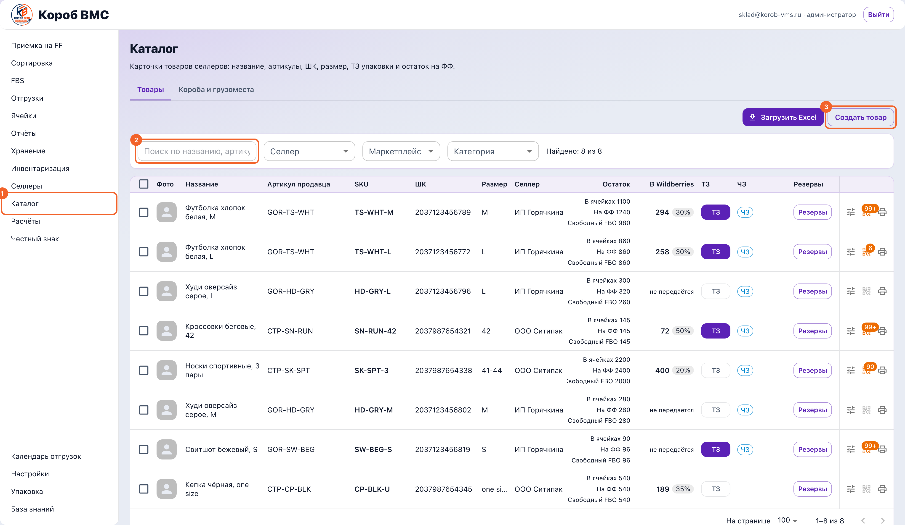
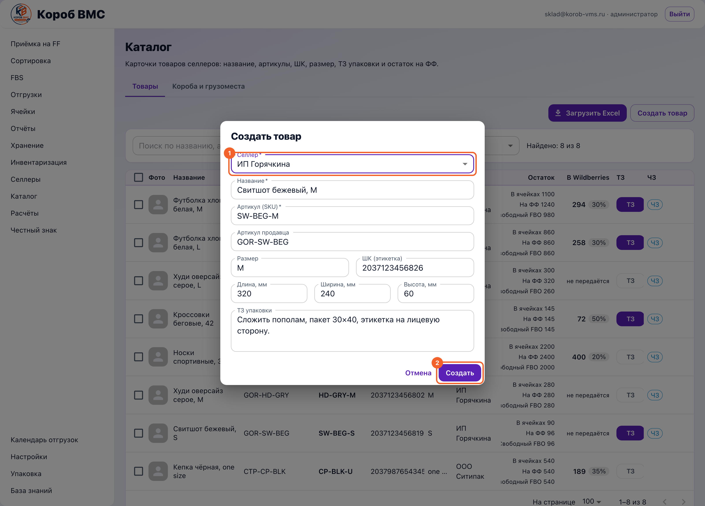

## Зачем это нужно

Каталог — это список всех товаров, которые склад вообще умеет принимать, хранить и отгружать. Пока товара нет в каталоге, его нельзя принять по приёмке (это движение «селлер → фулфилмент»), нельзя положить в ячейку, нельзя собрать по нему заказ FBS и нельзя выставить за него счёт. Каждая строка каталога — это карточка одной конкретной позиции: не «футболка вообще», а футболка конкретного селлера конкретного размера со своим штрихкодом.

Именно из карточки склад берёт всё, что нужно руками: какой штрихкод наклеить на товар, нужен ли на него Честный знак (обязательная государственная маркировка, её ещё называют ЧЗ или КМ — код маркировки), что написано в ТЗ упаковки (техническое задание — текстовая инструкция селлера о том, как товар паковать), и сколько места он занимает — по габаритам считается объём в литрах, а по объёму потом считается хранение. Ошибка в карточке не остаётся в карточке: неверный штрихкод — это пересорт на отгрузке, пустые габариты — это недосчитанные деньги за хранение.

## Шаг 1. Открыть каталог и найти товар

Открой пункт **«Каталог»** в левом меню. Под заголовком написано, что здесь лежат «Карточки товаров селлеров: название, артикулы, ШК, размер, ТЗ упаковки и остаток на ФФ». Кнопки **«Создать товар»** и «Загрузить Excel» видит только администратор фулфилмента — у остальных сотрудников каталог открывается на просмотр.

Сверху две вкладки: **«Товары»** (открывается по умолчанию) и **«Короба и грузоместа»**. Всё, что дальше про карточки, живёт на вкладке «Товары».

Нужный товар ищется через панель фильтров. Поле поиска подписано «Поиск по названию, артикулу, SKU или ШК» — запрос уходит на сервер сам, примерно через четверть секунды после того, как ты перестал печатать, кнопку жать не надо. Рядом три выпадающих списка: «Селлер», «Маркетплейс» (значения «Все», «Wildberries», «Ozon») и «Категория». Справа счётчик вида «Найдено: 12 из 3480» — сколько строк подошло под фильтр и сколько всего товаров в твоей области видимости.

## Шаг 2. Прочитать строку таблицы

Слева галочка для массовых действий, дальше «Фото», «Название», «Артикул продавца», «SKU» (внутренний артикул товара в WMS, уникален в паре «селлер + артикул»), «ШК» (штрихкод, он же баркод — те самые цифры под полосками на этикетке), «Размер», «Селлер», «Остаток», «В Wildberries», «ТЗ», «ЧЗ», «Резервы» и крайняя правая колонка со значками. Наведи курсор на фото — оно откроется увеличенным; если фото нет или ссылка протухла, вместо картинки будет серый силуэт.

В колонке **«Остаток»** три числа друг под другом: «В ячейках» (сколько лежит в адресном хранении), «На ФФ» (сколько всего на фулфилменте) и «Свободный FBO» (сколько не занято резервами и направлениями). Соседняя колонка «В Wildberries» показывает, сколько штук уходит в WB по правилу FBS, либо надпись «не передаётся», если передача остатка для этого товара выключена.

## Шаг 3. Завести товар вручную

Это основной путь, когда карточки в Wildberries нет, а принимать товар надо уже сегодня. Кнопка **«Создать товар»** открывает окно, где обязательны **«Селлер»**, **«Название»** и **«Артикул (SKU)»**; дополнительно есть «Артикул продавца», «Размер», «ШК (этикетка)», три поля габаритов и «ТЗ упаковки». Кнопка **«Создать»** заводит карточку, и товар сразу становится доступен приёмке.

Габариты вносятся числами в миллиметрах — поля «Длина, мм», «Ширина, мм», «Высота, мм». Правило жёсткое: либо все три, либо ни одного, частично заполненные не принимаются. Объём в литрах отдельным полем не вводится, он считается сам: длина × ширина × высота в миллиметрах, делённые на миллион. Коробка 200 × 150 × 40 мм — это 1,2 литра. Именно из этого литража потом берётся плата за хранение, поэтому пустые габариты — это не «мелочь на потом», а недосчитанные деньги.

## Шаг 4. Заполнить карточку и ТЗ упаковки

Карточка открывается кнопкой **«ТЗ»** в одноимённой колонке. Если кнопка залита цветом — инструкция для склада уже написана, подсказка при наведении будет «Редактировать ТЗ»; если кнопка бледная и в рамке — инструкции нет, подсказка «Добавить ТЗ». Откроется окно «Карточка товара», в шапке которого показаны SKU и название.

Поле **«Артикул Wildberries»** серое и не редактируется. Это не поломка: артикул, фото, размер и штрихкоды подтягиваются из карточек Wildberries, импортированных по этому селлеру, и руками из каталога не правятся.

Если товар продаётся ещё и на Ozon, заполни **«SKU Ozon»** и (или) **«Артикул Ozon»**. Достаточно одного из двух полей, но совсем пустыми оставить оба нельзя — система ответит «Укажите SKU или артикул Ozon.». После сохранения в колонке «Артикул продавца» у этой строки появится синяя метка «Ozon», а фильтр «Маркетплейс» со значением «Ozon» начнёт эту строку показывать.

Остальные поля: **«Страна изготовления (ISO, 2 буквы)»** — двухбуквенный код, например `RU` или `CN`; галочка **«Нужен Честный знак при упаковке»** — её ставят для маркируемого товара; **«Инструкция для склада»** — многострочное поле, куда переносится ТЗ упаковки от селлера. Кнопка **«Печать»** выносит инструкцию на бумагу к рабочему месту: лист A4 с SKU, названием, селлером, текстом инструкции и отдельной плашкой «Нужен Честный знак при упаковке», когда галочка стоит. Затем «Сохранить» — окно закроется, таблица перечитается.

## Шаг 5. Напечатать этикетку

Значок принтера в правой колонке строки (подсказка «Печать ЧЗ и ШК ВБ») открывает окно печати — «Печать ШК ВБ» для обычного товара или «Печать ЧЗ» для маркируемого, где выбирается размер этикетки, ориентация и количество. Соседний значок с QR-кодом подписан «Коды маркировки» и числом на бейдже — он уводит на экран Честного знака по этому товару.

## Шаг 6. Где габариты правятся потом

В самом каталоге полей размеров у уже заведённой карточки нет — это регулярно сбивает с толку. Габариты вносят одним из двух способов: значком **«Габариты»** в строке документа приёмки (откроется окно «Габариты товара» с полями в миллиметрах и «Вес, г») либо в разделе **«Хранение»**, где у строк без габаритов стоит кнопка **«Внести обмер»**. Во втором окне размеры вводятся уже в сантиметрах, а объём в литрах пересчитывается прямо на глазах.

## Шаг 7. Загрузить пачкой из Excel

Этот путь нужен, когда позиций десятки и вбивать их по одной бессмысленно. Кнопка **«Загрузить Excel»** открывает окно «Загрузить товары из Excel»: сначала выбери «Селлер», потом нажми **«Скачать шаблон»** — придёт файл с листом «Каталог товаров» и колонками «Название товара», «Артикул продавца», «SKU», «Штрихкод», «WB/nmId», «Размер», «ТЗ упаковки». Заполни его и нажми «Выбрать .xlsx».

Обязательно посмотри предпросмотр перед применением. Система разберёт файл и покажет строку вида «Лист «Каталог товаров»: создать 40, обновить 12, пропустить 0, ошибок 3», а под ней таблицу по строкам с колонками «Строка», «Название», «Артикул селлера», «SKU», «ШК», «WB/nmId», «Размер», «Действие», «ТЗ» и «Причина». Товар опознаётся по штрихкоду внутри выбранного селлера: нашёлся — «обновить», не нашёлся — «создать». Кнопка **«Применить»** станет активной, когда ошибок нет либо когда ты сознательно поставил галочку «Игнорировать строки с ошибками».

## Шаг 8. Настроить передачу остатка в Wildberries

Если этого просит селлер, отметь галочками нужные строки — над таблицей появится панель «Выбрано N» с кнопкой **«Задать остаток · N»**; то же окно открывается значком с ползунками в строке (подсказка «Остаток для FBS»). Внутри — галочка «Передавать остаток в Wildberries», ползунок «Доля свободного остатка» и список складов WB с выбором физического «Склад WMS».

## Шаг 9. Посмотреть, что лежит в коробе

Вкладка **«Короба и грузоместа»** отвечает на вопрос «что внутри вот этой коробки». Поле «Сканер короба или грузоместа» ждёт внутренний штрихкод: сканируй его или введи руками и нажми Enter — нужный короб раскроется и подсветится зелёным. Внутри видно состав: «Фото», «Название», «Артикул продавца», «SKU», «ШК», «Размер», «Селлер», «В коробе» и «Документ прихода».

## Частые ошибки и что делать

- **«Такой штрихкод уже занят.» при создании товара или «Штрихкод уже занят другим селлером в этом ФФ» в импорте.** Один и тот же штрихкод не может принадлежать двум карточкам. Найди товар поиском по этому штрихкоду — почти всегда карточка уже заведена, и создавать вторую не нужно. Если баркод числится за другим юрлицом, своей волей это не решается: уточни у администратора и селлера, чей это товар на самом деле, иначе остатки двух разных клиентов слипнутся в один.

- **«Такой артикул (SKU) уже есть.» или в предпросмотре импорта «Артикул уже занят другим товаром».** Артикул уникален внутри селлера, и он уже занят карточкой с другим штрихкодом. Добавь к артикулу размер или другой отличительный признак — например `ART-001/46` вместо `ART-001`.

- **«Укажите все три габарита или оставьте пустыми.»** Заполнены одно или два поля из трёх. Либо домерь товар и введи все три размера, либо очисти все три и внеси габариты позже — через обмер в разделе «Хранение» или значок «Габариты» в приёмке.

- **В строке нет фото, пустая «Категория», а в «ШК» стоит прочерк.** Товар не связан с карточкой Wildberries: фото, категория и штрихкоды берутся из импортированных карточек WB и находятся по паре «селлер + nmID» (nmID — номер карточки товара в Wildberries). Сам исправить это из каталога нельзя — привязка делается администратором на экране интеграции с Wildberries. До тех пор товар не найдётся сканированием и печатать по нему товарную этикетку нечем.

- **В предпросмотре импорта строки красные: «Нет артикула продавца (проверьте объединённые ячейки)» или «Нет штрихкода».** Обычная причина — объединённые ячейки в Excel: значение физически лежит только в первой строке блока, а остальные читаются пустыми. Разъедини ячейки и продублируй артикул в каждой строке. Штрихкод должен быть числом из 8–32 цифр — текст, пробелы внутри и формулы не подходят.

- **Импорт отвечает «Этот файл уже применён. Повторных изменений не внесено.»** Ровно этот файл по этому селлеру уже загружали, и повторно он ничего не сделает — так система защищается от двойного применения. Это не ошибка: проверь каталог, товары там уже есть. Нужно догрузить новое — правь файл и загружай изменённую версию.

- **«Выберите товары с продавцом: без него складов WB нет» или сообщение о разных продавцах при нажатии «Задать остаток».** Склады Wildberries у каждого селлера свои, поэтому в одном выделении должен остаться один селлер. Поставь фильтр «Селлер», выдели строки заново и повтори.

- **На вкладке «Короба и грузоместа» на скан отвечает «Короб или грузоместо не найдено».** Скорее всего отсканирован не внутренний штрихкод короба, а товарная этикетка или маркировка перевозчика. Возьми ярлык, который склад наклеил на короб при приёмке. Если короба ещё нет в системе, его сначала создают в разделе «Приёмка на FF».
