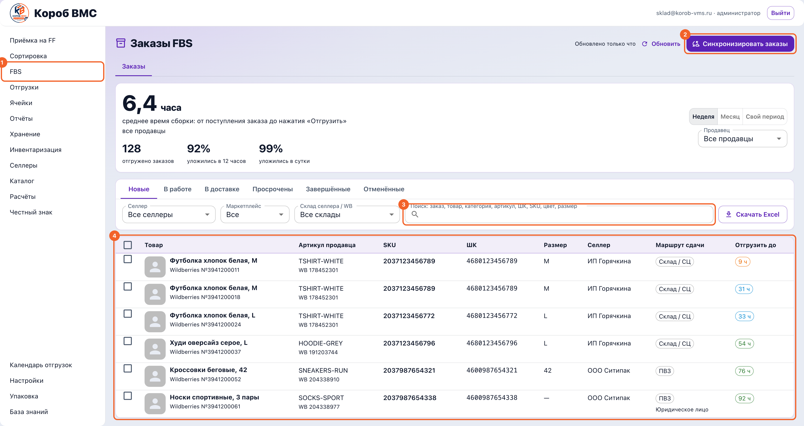
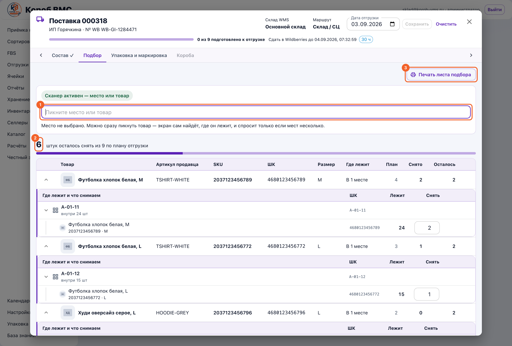
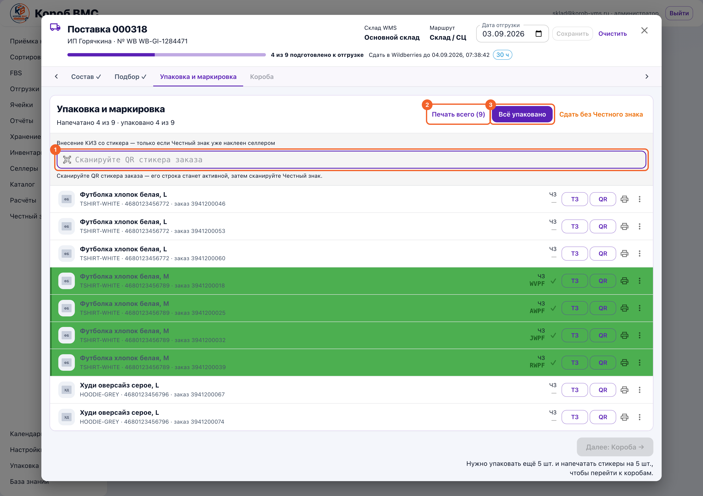
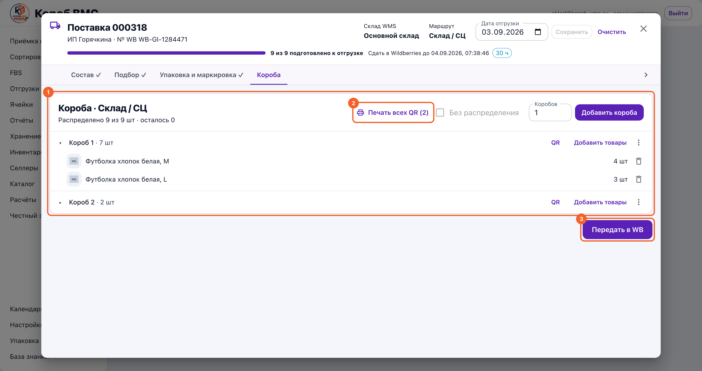

## Зачем это нужно

ФБС (FBS, от Fulfillment by Seller — «сборка силами продавца») — это схема, при которой товар всё время лежит у нас на складе фулфилмента. Покупатель нажимает «Купить» на Wildberries, заказ прилетает к нам, и дальше всё делает склад: находит товар на полке, клеит на него стикер заказа, упаковывает, складывает в короб и отдаёт перевозчику WB. Противоположная схема — ФБО (FBO, Fulfillment by Operator): там товар заранее увезли на склад маркетплейса, и сборкой занимается сам маркетплейс, а мы к конкретному заказу уже не прикасаемся. Разница простая: при ФБО мы отгружаем партию один раз и забываем, при ФБС мы работаем с каждым отдельным заказом покупателя.

Отсюда и цена ошибки. У каждого заказа ФБС есть срок сборки: WMS считает его как 120 часов с момента, когда заказ создан в WB, и показывает остаток в колонке «Отгрузить до». Не успели — WB заказ уже не примет, он уедет на вкладку «Просрочены», а селлер получит штраф и просевший рейтинг. Поэтому весь этот блок построен вокруг одного документа — **поставки**: это пачка заказов одного селлера с одного склада WB, которую собирают, упаковывают и передают в WB целиком, одним движением. Заказ, не попавший в поставку, никуда не уедет, сколько его ни упаковывай.

## Шаг 1. Открыть заказы FBS

Пункт **«FBS»** в левом меню открывает экран **«Заказы FBS»**. Под заголовком стоит поднавигация с единственной вкладкой «Заказы», а над таблицей — панель среднего времени сборки: крупная цифра в часах и переключатель периода «Неделя», «Месяц», «Свой период» с отдельным выбором продавца. Панель отвечает на вопрос «как мы работаем в целом», а не «где вот этот заказ», поэтому её фильтры с фильтрами таблицы намеренно не связаны.

Заказы приезжают сами: WMS в фоне опрашивает Wildberries по умолчанию каждые три минуты и отдельно обновляет статусы уже взятых заказов раз в десять минут. Сам список на экране перечитывается каждые тридцать секунд, пока вкладка браузера открыта; справа сверху видна отметка вида «Обновлено 2 минуты назад» и кнопка **«Обновить»**. Если ждать некогда, у администратора есть кнопка **«Синхронизировать заказы»** — она ходит в WB немедленно и по окончании показывает зелёную плашку вида «Wildberries: получено 40, новых 12, обновлено статусов 5». У обычного оператора этой кнопки нет, и это нормально.

Вкладок шесть: **«Новые»**, **«В работе»**, **«В доставке»**, **«Просрочены»**, **«Завершённые»**, **«Отменённые»**. Важная тонкость: «Новые», «Просрочены» и «Отменённые» показывают отдельные заказы, а «В работе», «В доставке» и «Завершённые» — уже собранные поставки целиком, потому что после формирования поставки работают с документом, а не с каждым заказом по отдельности.

На вкладке «Новые» таблица идёт колонками «Товар», «Артикул продавца», «SKU», «ШК» (штрихкод), «Размер», «Селлер», «Маршрут сдачи» и «Отгрузить до». На «Просрочены» и «Отменённые» к ним добавляется «Статус». В колонке «Маршрут сдачи» стоит чип **«ПВЗ»** (пункт выдачи заказов) или **«Склад / СЦ»** (склад или сортировочный центр WB) — это то, куда WB разрешает сдать конкретный заказ. Плашка «Отгрузить до» показывает остаток часов: больше двух суток — зелёная, меньше 48 часов — синяя, меньше 12 — жёлтая, а по истечении срока — красная с надписью «Просрочен».

Сузить список помогают фильтры сверху: «Селлер», «Маркетплейс», на «Новых» ещё и «Склад селлера / WB», плюс поле «Поиск: заказ, товар, категория, артикул, ШК, SKU, цвет, размер» — найденные строки подсвечиваются жёлтым, и экран сам прокручивается к первой. Кнопка **«Скачать Excel»** выгружает то, что вы видите, а если что-то отмечено галками — только отмеченное.

## Шаг 2. Отобрать заказы в одну поставку

Отметьте галками заказы, которые пойдут вместе. Если галка не ставится, под названием товара красным написано, почему: **«Товар не сопоставлен с карточкой.»**, **«Заказ уже в поставке.»**, **«Склад WB не привязан — настроить в каталоге»**, **«Срок сборки истёк.»**, **«Заказ отменён или брак.»** или **«Заказ уже ушёл в кабинете WB.»**

Отдельно стоит предупреждение **«Публикация FBS-остатка для товара выключена.»** — оно не мешает собрать заказ: срок идёт, и публикация остатка к сборке отношения не имеет. В основной таблице оно, в отличие от остальных, не показывается (это единственный блокер, который не считается «настоящим» и не подсвечивает строку красным) — увидеть его текстом можно, только открыв «Показать выбранные» после того, как заказ уже отмечен галкой.

Внизу экрана всплывёт панель **«Выбрано заказов: N»**. В ней четыре кнопки: «Показать выбранные» (посмотреть список и убрать лишнее), «Снять выбор», «Добавить в существующую поставку» и главная — **«Сформировать поставку»**. Заказы Wildberries и Ozon в одну поставку не объединяются, панель об этом честно скажет.

## Шаг 3. Сформировать поставку

Нажмите **«Сформировать поставку»** — откроется окно «Новая поставка FBS». Выберите **«Планируемый способ сдачи»**: «Склад или сортировочный центр» либо «Пункт выдачи». Пока вы выбираете, WMS перепроверяет состав на сервере и показывает сводку — «Селлер», «Склад WB», «Склад WMS», «Заказов», «Грузовой тип», «Контроль сборки», при B2B-заказах ещё «Покупатель: Юридическое лицо», а при заказах с обязательной маркировкой — «Нужна маркировка: N» — и чип: зелёный «Можно создать поставку» или красный «Есть причины, которые нужно исправить» со списком причин.

Нажмите **«Создать поставку»**. Она заводится не только у нас, но и в кабинете Wildberries, поэтому у документа сразу появляется номер вида «WB №1234567». Если WB ответил не сразу, окно предложит «Повторить проверку» — жать безопасно, вторая поставка от этого не создастся.

## Шаг 4. Разобраться в рабочем месте поставки

Рабочее место открывается само. В шапке — название поставки, селлер и номер WB, метрики «Склад WMS» и «Маршрут», поле «Дата отгрузки» с кнопками «Сохранить» и «Очистить», полоса прогресса «N из M подготовлено к отгрузке» и срок «Сдать в Wildberries до …».

Внутри четыре вкладки-этапа: **«Состав»**, **«Подбор»**, **«Упаковка и маркировка»**, **«Короба»**. Для поставок Wildberries все четыре открыты сразу, включая «Короба», — это сознательное решение: ни один из этапов не запирает следующий, и в короб можно положить заказ, который ещё не упакован. Пройденный этап помечается галочкой.

На вкладке «Состав» проверьте, что попало в поставку: таблица с колонками «Фото», «Заказ WB», «Товар и идентификаторы», «Количество», «Маркировка» и «Подбор». Кнопка **«Добавить заказы»** докидывает новые заказы того же селлера и того же склада WB, если машина ещё не ушла.

## Шаг 5. Начать работу и распечатать лист подбора

Нажмите **«Начать работу с поставкой»**. Это не формальность: по этой кнопке сервер создаёт единственное задание на упаковку, переводит поставку из статуса «Черновик» в «В работе» и заранее запрашивает у WB стикеры заказов, чтобы к моменту упаковки они уже лежали готовыми. Пока задание не создано, вкладка упаковки останется заглушкой.

Кнопка **«Печать листа подбора»** (она есть и на «Составе», и на «Подборе») выдаёт альбомный лист A4 с колонками «№», «Фото», «Товар и идентификаторы», «Размер», «Ячейка», «Заказы WB», «Стикер», «Взять», «Подобрано» и «Маркировка». Колонка «Ячейка» появляется, если у склада включено адресное хранение. Если окно печати не открылось, разрешите браузеру всплывающие окна.

## Шаг 6. Подобрать товар с полок

Вкладка **«Подбор»** — это тот же экран, что и в отгрузке на маркетплейс: строка идёт от товара, колонки — «Товар», «Артикул продавца», «ШК», «Размер», «Где лежит», «План», «Снято», «Осталось».

Сначала отсканируйте ячейку или тару (короб, палету, грузоместо) — под полем скана появится строка «Снимаем с: …», — а потом бейте штрихкоды товара: каждый скан снимает одну штуку именно с этого места. Если считаете пачкой, число можно вписать руками в поле нужного места, оно сохранится само.

Место сканировать не обязательно: можно сразу пикнуть товар, и экран сам найдёт, где он лежит. Но если товар лежит в нескольких местах, за вас никто выбирать не будет — система скажет «лежит в N местах — уточните место или укажите число руками» и ничего не спишет. Это защита от того, чтобы остаток списался не с той полки. Ошиблись — значок отмены в строке вернёт последнее снятие ровно туда, откуда сняли.

Внизу две кнопки: **«Отложить»** (закрывает окно поставки, снятое сохранено) и **«Завершить подбор»**, которая не нажимается, пока собран не весь план.

## Шаг 7. Упаковать и промаркировать

Вкладка **«Упаковка и маркировка»**. Сверху счётчик «Напечатано X из Y · упаковано A из B», ниже — по строке на каждый заказ: фото, название, артикул, ШК и номер заказа, колонка «ЧЗ» (Честный знак), а справа кнопки «ТЗ» (техническое задание — инструкция, как упаковывать этот товар), «QR», значок принтера и значок «три точки».

Кнопка **«Печать всего (N)»** собирает одну ленту на всю поставку: в неё идут QR стикера заказа WB, штрихкод товара и, если нужно, Честный знак — окно называется «Печать ЧЗ, ШК и QR заказа», если хотя бы одному из напечатанных заказов нужна маркировка, и «Печать ШК и QR заказа» (без «ЧЗ»), если не нужна ни одному. Кнопка «QR» в строке печатает только стикер заказа WB через окно «Проверка перед печатью», где задаются «Копий каждого макета» и физический размер этикетки. Значок принтера печатает ЧЗ и ШК по одному заказу, а «три точки» → **«Перепечатать»** — это повтор без выпуска новых кодов маркировки, чтобы не жечь пул зря.

Если Честные знаки клеит селлер и они уже наклеены на товар, их вносят сканом. В поле сканера сначала бьётся QR стикера заказа — строка этого заказа станет активной и подсветится голубым, экран сам к ней прокрутится, — а следующим сканом идёт сам Честный знак. Код тут же уходит в WB, строка становится зелёной, и в колонке «ЧЗ» появляется хвост кода. Дальше сразу можно сканировать следующий стикер: поле само возвращает себе фокус.

Закончив, нажмите **«Всё упаковано»** — одно нажатие закрывает упаковку по всему заданию, подтверждать каждый товар отдельно не нужно. Если Честных знаков по части заказов не будет, есть кнопка **«Сдать без Честного знака»**: она снимает требование маркировки со всей поставки, уже отсканированные коды при этом сохранятся и уйдут как обычно, а на поставке появится жёлтый чип «Сдаём без Честного знака». Учтите: если Wildberries по заказу требует маркировку обязательной, сдать его без кода всё равно не выйдет — это ограничение маркетплейса.

## Шаг 8. Разложить по коробам

Вкладка **«Короба»** — заголовок покажет маршрут: «Короба · Склад / СЦ» или «Короба · ПВЗ». Впишите число в поле «Коробов» и нажмите **«Добавить короба»**: на каждый короб WB регистрирует своё грузоместо, и у него появляется собственный QR. Галка «Без распределения» заводит короба без разбора по товарам — её можно ставить и после того, как короба уже созданы, но как только в какой-то короб назначен хоть один товар, галка блокируется.

Кнопка **«Добавить товары»** в строке короба открывает окно «Добавить товары в короб N» с поиском и полем количества, кнопка «QR» печатает QR этого короба, а «три точки» дают «Очистить» и «Удалить» (удалить можно только пустой короб). Кнопка **«Печать всех QR (N)»** выдаёт ленту QR сразу по всем коробам. Под заголовком видно «Распределено X из Y шт · осталось Z» — пока остаток не ноль, часть упакованных заказов ни в одном коробе не лежит, и до перевозчика они не доедут.

## Шаг 9. Передать поставку в WB

Нажмите **«Передать в WB»** и подтвердите в окне «Передать поставку в WB?». Перед этим WMS сам прогоняет проверки: готовы ли стикеры заказов, закрыта ли маркировка, созданы ли физические короба, все ли упакованные заказы в них назначены. Кнопка подтверждения не нажмётся, пока хоть одна проверка красная. Помните предупреждение в окне: «После передачи поставку нельзя будет отменить или вернуть в работу.»

После передачи в рабочем месте появится блок **«QR поставки WB»** с кнопкой «Печать QR поставки» — этот QR едет вместе с грузом, и по нему WB принимает поставку целиком, а на каждый короб при этом клеится свой QR грузоместа. Сама поставка переедет на вкладку «В доставке», а после приёмки Wildberries — на «Завершённые». Распечатать QR можно и из списка поставок: в колонке «Печать» у каждой строки есть кнопка «QR».

> Этапы в рабочем месте — не жёсткие ворота: у поставок Wildberries все четыре вкладки открыты сразу. Подбор разрешено пропустить и уйти сразу в упаковку: например, когда товар уже стоит на столе. Вкладку «Короба» тоже можно открыть в любой момент, даже в черновике, и класть в короб заказы, которые ещё не упакованы, — упаковка на этом этапе не ворота, а просто отметка.

## Частые ошибки и что делать

- **«Склад WB не привязан — настроить в каталоге».** Заказ приехал со склада продавца в кабинете WB, который в WMS ни с чем не сопоставлен, поэтому система не знает, с какого физического склада снимать товар. Надпись кликабельная: она уводит в **«Каталог»** и открывает окно **«Остаток для FBS»**, где склад WB привязывается к складу WMS. Тот же корень у предупреждения после синхронизации: «Из кабинетов маркетплейсов не подхватилось N поставок — у их складов нет привязки к WMS».

- **«Товар не сопоставлен с карточкой».** В строке вместо названия стоит «Товар не сопоставлен»: заказ WB не нашёл карточку в нашем каталоге. Пока карточки нет, товар нечего искать на полке и не с чего списывать остаток — сначала заводится или сопоставляется карточка, и только потом заказ можно взять в поставку.

- **«Есть причины, которые нужно исправить» при создании поставки.** Одна поставка — это один селлер, один склад WB, один склад WMS, один тип груза и один тип покупателя. Система так и напишет: «Заказы принадлежат разным селлерам», «Заказы относятся к разным складам WB», «Нельзя смешивать B2C и B2B заказы в одной поставке». Лечится не уговорами, а разбиением выбора на несколько поставок.

- **«Не хватает Честных знаков: нужно N, в пуле M».** В пуле маркировки не осталось свободных кодов, и у части заказов в строке появится пометка «ЧЗ не хватило». Либо пул пополняют, либо — если коды физически клеит селлер — их вносят сканом прямо на вкладке упаковки. Гадать и печатать «как-нибудь» нельзя: без кода WB заказ не примет.

- **«Это не похоже на Честный знак».** Сканер прислал не то. Рядом с ошибкой есть ссылка **«Что приехало со сканера»** — она покажет длину строки, её начало и конец. Чаще всего виновата раскладка клавиатуры, потерянный разделитель внутри кода или лишний префикс сканера; система умеет их чинить сама и тогда пишет «исправлена раскладка», «восстановлен разделитель» или «убран префикс сканера». Если не вышло — проверьте настройку сканера, а не бейте один и тот же код по десять раз.

- **«WB не вернул готовых этикеток заказов. Печать не открыта».** Стикеры готовит Wildberries, и иногда они приезжают не сразу. В окне печати это же выглядит как «Готовых изображений нет: файлы не пришли от WB или пропали из хранилища». Подождите и запросите печать заново; в окне видно счётчик «Готово N», и готовые можно печатать, не дожидаясь остальных.

- **«Браузер заблокировал окно печати».** Лист подбора, лента этикеток и QR открываются во всплывающем окне. Разрешите всплывающие окна для WMS в браузере и повторите — иначе кнопка будет выглядеть неработающей, хотя дело не в системе.

- **«Поставка создана в Wildberries, недоступна в WMS».** Строка заказа серая и не открывается: поставку завели руками в кабинете WB, а локальной карточки у нас нет. Работать по такой поставке в WMS нельзя — её либо ведут в кабинете WB до конца, либо заказы собирают в поставку, созданную из WMS.

- **«Заказ уже передан в доставку — КИЗ не изменить».** После передачи поставки её состав, маркировка и упаковка заморожены: остаётся только печать этикеток и стикеров. Поэтому все проверки — состав, коды, короба — делаются до нажатия **«Передать в WB»**, а не после.
