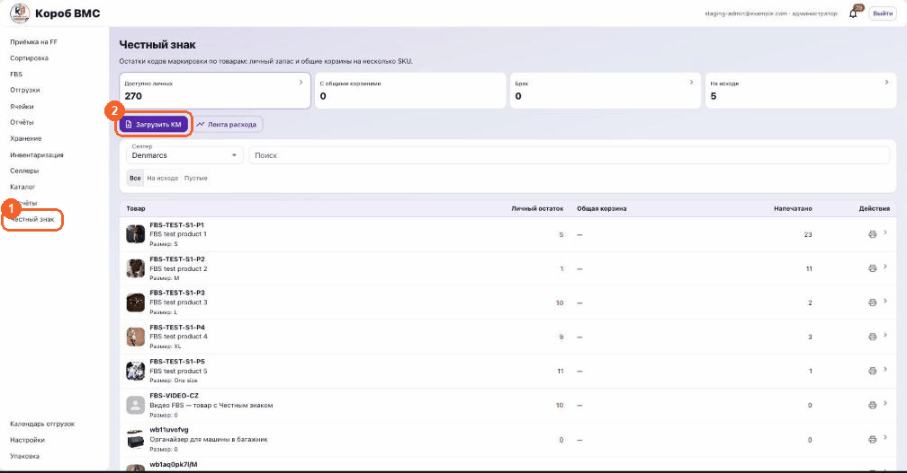
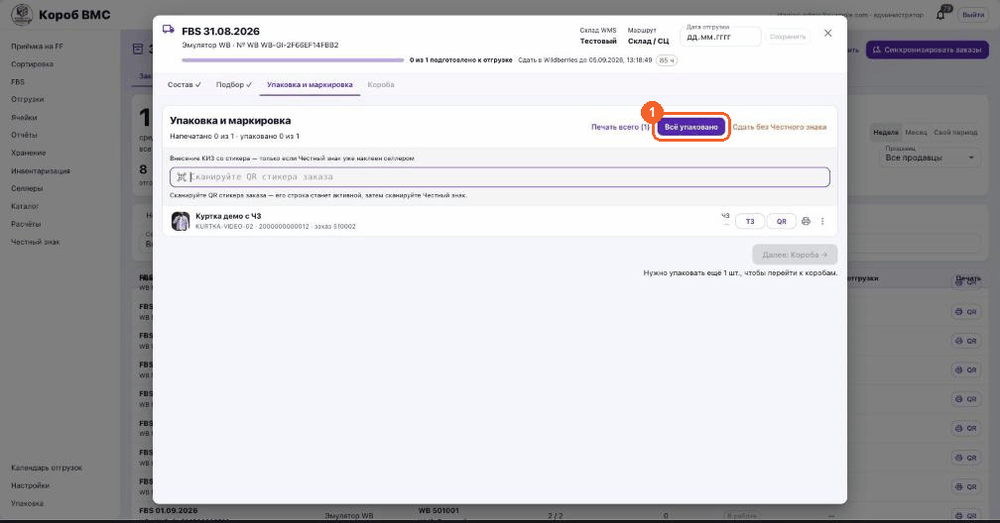

## Зачем это нужно

«Честный знак» — государственная система маркировки товаров. Смысл простой: у каждой отдельной единицы товара есть свой личный номер, который больше нигде не повторяется. Этот номер называется **КИЗ** — контрольный идентификационный знак; в нашей системе он подписан коротко, **КМ** (код маркировки). Печатается он в виде **DataMatrix** — маленького чёрно-белого квадратика, похожего на QR-код: именно его читает сканер и именно его мы клеим на товар. Коды покупает не склад, а селлер: он получает их в «Честном знаке» и передаёт нам файлом, а мы загружаем файл в систему, печатаем этикетки, клеим и при сборке заказа сообщаем маркетплейсу, какой именно код уехал в каком заказе.

Хранятся коды не россыпью, а **пулами**. Пул — это пачка кодов с одним и тем же **GTIN** (13–14-значный товарный номер, зашитый внутрь самого кода, по сути тот же штрихкод товара). Пул можно привязать к одному товару, а можно к нескольким — тогда он превращается в **общую корзину**, и на карточке появляется чип «Общая корзина · на N товаров»; остаток в такой корзине общий и между товарами поровну не делится. Пока код не принят маркетплейсом, заказ дальше не поедет: на финальном подтверждении система пишет «WB не принял маркировку.» или «WB ещё не подтвердил маркировку.», и только ответ «WB: маркировка подтверждена.» — зелёный свет. Поэтому непринятый код — это не мелочь на потом, а стоящий заказ.

> Ещё одно слово, которое можно услышать, — **агрегация**: это когда коды отдельных единиц «вкладывают» в код короба, чтобы на приёмке сканировать одну наклейку вместо всех единиц. В нашей системе такого шага нет: код привязывается к единице товара и к конкретному заказу поштучно.

## Порядок действий

### Загрузить коды селлера в пул

1. Откройте в левом меню пункт «Честный знак». Пункт виден администратору фулфилмента; если его нет — прав не хватает, обратитесь к администратору. Заголовок экрана — «Честный знак», под ним подпись «Остатки кодов маркировки по товарам: личный запас и общие корзины на несколько SKU».
2. Выберите селлера в поле «Селлер». Пока селлер не выбран, кнопка «Загрузить КМ» серая и по наведению показывает подсказку «Выберите селлера»: коды всегда принадлежат конкретному селлеру, общего склада кодов не существует.
3. Нажмите «Загрузить КМ». Откроется окно с областью «Перетащите или выберите CSV, TXT или PDF (можно несколько файлов)». Файлов можно кинуть сразу несколько, каждый до 25 МБ. Пока идёт разбор, видно строку «Разбор файла…».
4. Система сама вытащит коды, выбросит повторы внутри файла (покажет строку вида «Дубликаты в файле: 3») и разложит остальное по GTIN. На каждую группу появится карточка вида «GTIN …4321 — 250 КМ». В каждой заполните поле «Название пула» — без него загрузка не пойдёт, будет ошибка «Укажите название пула для каждого GTIN». Название вы придумываете сами, это просто человекочитаемая подпись пачки.
5. Отметьте галочками товары под названием пула (есть поле «Поиск товаров»). Если не отметить ни одного, появится жёлтый чип «Товары не выбраны — можно привязать позже» — загрузить всё равно можно. Сверьте итог «Будет загружено: N КМ в M пул(ов), привязка к K товарам» и нажмите «Загрузить». Внизу экрана появится «Загружено N» или «Загружено N, пропущено M (дубликаты/ошибки)».

### Привязать пул к товарам

1. Если на экране «Честный знак» висит синяя плашка «Кодов без привязки к товару: N», значит коды лежат, но система не знает, кому их выдавать. Внизу той же страницы появится таблица «Пул без привязки» с колонками «GTIN», «Доступно» и кнопкой «Привязать».
2. Кнопка открывает карточку пула на вкладке «Товары» (рядом вкладки «Обзор», «Коды», «Лента»). Нажмите иконку со звеном цепи «Привязать товары» — откроется окно «Привязать товары» с названием пула в заголовке, списком товаров этого селлера и поиском. Отметьте нужные и нажмите «Сохранить».
3. Держите в голове два правила. Первое: остаток КМ общий на весь пул, а не на каждый товар — об этом прямо написано в подсказке на вкладке. Второе: в таблицу экрана «Честный знак» товар попадает, если у него в карточке включён признак «Нужен Честный знак при упаковке» («Каталог» → товар) либо на него уже есть коды или привязанный пул. В окне загрузки для привязки показываются только товары с этим признаком.

### Напечатать этикетки

1. Печатать можно из трёх мест. Из каталога кодов: на экране «Честный знак» в строке товара есть иконка принтера с подсказкой «Печать ЧЗ и ШК ВБ». Из работы: «Упаковка» → задание → кнопка «Печать ЧЗ» в строке товара. И списком: «Упаковка» → кнопка «Осталось промаркировать» → «Печать» в строке либо «Печать выбранных (N)» по галочкам.
2. В окне печати сверху стоит переключатель «Как печатать ЧЗ и ШК ВБ» с двумя положениями. «Вместе на одной ленте» — обе этикетки идут одной лентой, порядок блоков перетаскивается мышкой, а количество задаётся полями «ЧЗ» и «ШК ВБ» на единицу. «Раздельно: ЧЗ и ШК отдельно» — вместо ленты появляются два самостоятельных блока, «Честный знак» и «ШК ВБ», у каждого свой размер этикетки, своё количество и своя кнопка печати. Отдельной страницы настроек для этого переключателя нет: положение по умолчанию — это то, что вы (или коллега на этом же компьютере) в прошлый раз выбрали в этом же окне печати, оно запоминается в браузере. При открытии окна видна строка «Проверяем настройку раздельной печати…».
3. Выберите размер этикетки (58 × 40, 60 × 80, 60 × 40 или 70 × 120 мм) и ориентацию — «Вертикальная» или «Горизонтальная». В раздельном режиме у блока «Честный знак» это поля «ЧЗ на единицу» и «Размер ЧЗ» и кнопка «Печать ЧЗ», которая после печати превращается в «ЧЗ напечатаны ✓»; у блока «ШК ВБ» — «Количество этикеток», галочка «Печатать 2 ШК» и кнопка «Печать ШК ВБ», её можно нажимать сколько угодно раз. Закрывается такое окно кнопкой «Закрыть», отдельного общего «Печать» в нём нет.
4. Печать — это расход. Коды переходят из статуса «Доступен» в «Напечатан», в ленту падает событие «Печать», и в таблице растёт колонка «Напечатано». Если по строке уже печатали, система предупредит: «ЧЗ по этой строке уже печатался ранее. Повторная печать выпустит те же КМ.» Осознанный повтор делается через меню строки в «Упаковке» → «Повтор»: откроется «Повторная печать», где можно отметить конкретные КМ («Выбрать все» / «Снять всё») и нажать «Перепечатать» — новые коды из пула при этом не берутся.

### Отдать код маркетплейсу

1. При сборке FBS-поставки на вкладке упаковки есть строка скана. Сначала сканируется QR стикера заказа (в поле написано «Сканируйте QR стикера заказа»), строка заказа становится активной, затем сканируется сам Честный знак — подпись меняется на «Сканируйте Честный знак», а система пишет, что «код привяжется и уйдёт в WB».
2. Если ЧЗ печатался лентой из пула кнопкой «Печать всего», код уходит в WB прямо в момент печати — отдельно сканировать его не нужно. Ручной скан со стикера нужен для чужих кодов: тех, что селлер наклеил сам.
3. Проверить, что и куда ушло, можно двумя способами. Кнопка «Лента расхода» на экране «Честный знак» открывает журнал всех событий по кодам с фильтрами «Тип события», «Документ», «С», «По», «Поиск КМ» и кнопкой «Экспорт». А карточка конкретного товара (клик по строке) показывает блоки «Откуда коды», «Коды» и «Лента» — то же самое, но только по этому SKU.

### Если код испорчен или WB его не принял

1. Сначала различите два случая. Если испортилась только этикетка, а сам код цел, это не брак: повторите печать через «Повтор» в меню строки задания, как описано выше, — уйдёт тот же самый КМ, пул не потратится. Брак ставят, когда негоден сам код: «Упаковка» → задание → меню строки (три точки) → «Брак» → окно «Отметить брак КМ», где выбирают конкретный КМ, вписывают «Причина брака» и жмут «Подтвердить брак». Код сразу получает статус «Брак», а старшему смены уходит запрос.
2. Очередь запросов разбирает старший смены на странице «Перепечатка КМ» (адрес `/app/ff/honest-sign/reprints`, ссылки в меню нет, доступ — по блоку прав «старший смены»). Кнопок там три, но на этой очереди работают две. «Заменить» — списать текущий КМ и выдать новый из пула: старый станет «Заменён», остаток пула уменьшится на 1. «Отклонить» — с обязательной причиной, её увидит заявитель. Кнопка «Подтвердить», по подсказке разрешающая повтор того же КМ, принимает только код в статусе «Напечатан», а в очередь запрос всегда приходит уже с браком — в ответ придёт ошибка `code_not_printed`. Поэтому повтор целой этикетки делают шагом выше, до отметки брака, а не через очередь.
3. При скане Честного знака отказ маркетплейса приходит прямо в строку скана. «WB не принял:» и дальше причина словами от самого маркетплейса — это отказ по существу. «WB недоступен, попробуйте ещё раз» — это про связь, а не про код: просто повторите.
4. Что при отказе происходит с кодом. Если код вносится на заказ впервые и WB его не принял, система откатывает всю операцию целиком: привязки нет, события в ленте нет, код в пуле остаётся «Доступен» — ничего не сгорело, берите следующий код. Если вы меняли уже внесённый код и новый не прошёл, система пытается вернуть в WB прежний; когда и это не удаётся, случай считается аварийным, и разбирать его руками из зала не надо — зовите старшего. Если код печатался лентой и не ушёл в WB, он уже списан из пула и остаётся закреплён за заказом; повторная печать по этому заказу возьмёт тот же самый код, а не новый, второй раз пул не потратится.
5. Пока маркировка не принята, заказ в доставку не отдать. На подтверждении система показывает одну короткую строку: «WB не принял маркировку.», «WB подтвердил другой код маркировки.» или «WB ещё не подтвердил маркировку.». Пропускает только «WB: маркировка подтверждена.» и «WB: маркировка не требуется.».

## Частые ошибки и что делать

- **Кнопка «Загрузить КМ» серая, при наведении — «Выберите селлера».** Сначала выберите селлера в поле «Селлер» на том же экране: коды всегда принадлежат конкретному селлеру, «в общий котёл» их загрузить нельзя.
- **При загрузке вылезло «Укажите название пула для каждого GTIN».** Карточка с пустым названием подсветится красным, и страница сама прокрутится к ней. Впишите любое понятное название пачки и нажмите «Загрузить» ещё раз.
- **В окне загрузки список товаров пустой: «У этого селлера нет товаров с признаком "Нужен Честный знак при упаковке"».** Для привязки при загрузке система показывает только такие товары. Включите галочку «Нужен Честный знак при упаковке» в карточке товара в «Каталоге» и загрузите файл заново; либо загрузите коды без привязки и привяжите товары позже из карточки пула.
- **Загрузилось меньше, чем в файле: «Загружено N, пропущено M (дубликаты/ошибки)».** Пропущены строки, которые уже есть в базе (этот файл или его часть уже грузили) или не похожи на код маркировки. Сверьте число с ожидаемым по карточке пула на вкладке «Обзор» — там есть таблица «История загрузок» с колонками «Документ», «Файл» и «Принято».
- **При печати красная плашка «Не хватает N из M КМ».** В пуле кончились свободные коды. Можно поставить галочку «Печатать доступные N» и напечатать часть, но правильный шаг — попросить селлера догрузить коды. В раздельном режиме то же самое написано текстом под кнопкой: «Печать ЧЗ недоступна: в пуле нет свободных кодов маркировки. Пополните пул или обратитесь к администратору.»
- **Синяя плашка «Кодов без привязки к товару: N».** Коды загружены, но система не знает, какому товару их выдавать, и печать по товару работать не будет. Откройте таблицу «Пул без привязки» внизу страницы, нажмите «Привязать» и отметьте товары на вкладке «Товары».
- **При скане ошибка «Это не похоже на Честный знак».** Скорее всего, отсканирован не тот код (обычный штрихкод вместо DataMatrix) или сканер отдал мусор из-за раскладки. Рядом с ошибкой есть ссылка «Что приехало со сканера» — она покажет длину строки, её начало и конец; по этому сразу видно, пришёл ли КМ вообще. Переключите раскладку на английскую и сканируйте ещё раз.
- **«Этот КИЗ уже внесён в заказ № … от …» или «Заказ уже передан в доставку — КИЗ не изменить».** В первом случае код физически наклеен на другой заказ — найдите его в «Ленте расхода» через «Поиск КМ» и разберитесь, что уехало не туда. Во втором менять код уже поздно: заказ ушёл в доставку, правки закрыты, вопрос решается только через старшего.
