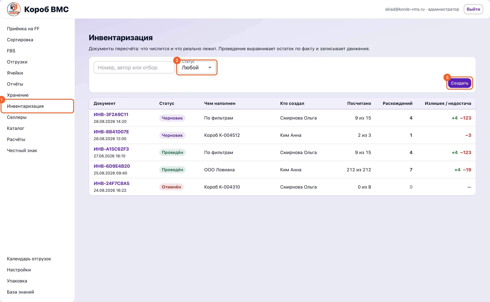
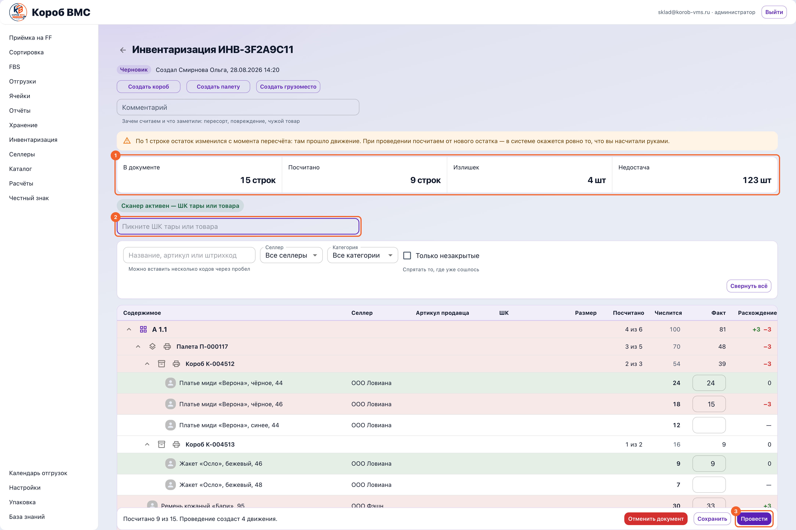

## Зачем это нужно

Система хранит остаток числом, а полка живёт своей жизнью: что-то положили не туда, что-то ушло без документа, где-то приехало лишнее. Инвентаризация (пересчёт) — это документ, который по каждой строке ставит рядом два числа: **«Числится»** — что система думает, и **«Факт»** — что вы реально нашли руками. Сам экран описывает себя так: «Документы пересчёта: что числится и что реально лежит. Проведение выравнивает остаток по факту и записывает движения». Пока документ в статусе **«Черновик»**, склад в системе не меняется вообще — выравнивание происходит ровно в момент проведения.

Не путайте два соседних пункта меню. **«Хранение»** — это про деньги: расчёт хранения по селлерам за месяц, обмеры товара и фиксация месяца для начисления. **«Инвентаризация»** — про товар: сколько штук лежит на самом деле. Адреса в браузере у них исторически разъехались: пункт «Инвентаризация» открывает `/app/ff/stocktaking`, а адрес `/app/ff/inventory` занят экраном «Хранение». В меню всё правильно — ориентируйтесь на название пункта, а не на строку адреса.

## Шаг 1. Завести документ пересчёта

Пересчёт всегда начинается с документа: пока его нет, считать некуда — записывать факт просто некому.

Откройте в левом меню пункт **«Инвентаризация»**. Это список документов пересчёта: колонки «Документ» (номер вида `ИНВ-3F2A9C11` и дата создания), «Статус», «Чем наполнен», «Кто создал», «Посчитано», «Расхождений» и «Излишек / недостача». Сверху — фильтр «Статус» (Черновик, Проведён, Отменён) и поиск по номеру, автору или отбору.

Новый пересчёт заводится кнопкой **«Создать»**. В окне «Новая инвентаризация» выберите «Склад», при необходимости сузьте отбор полями «Селлер» и «Категория» и напишите «Комментарий» — зачем считаем. Окно само подсказывает, что получится: «Фильтры не выбраны — в документ попадёт весь склад целиком».

Нажмите **«Создать»** — документ откроется сразу. Строки система набирает сама из остатков, где есть хотя бы одна штука. Одна строка — это один товар в одном месте: в конкретной ячейке и в конкретной таре. Один и тот же товар в двух ячейках даст две разные строки. Дописать строку руками нельзя: инвентаризация начинается с того, что уже числится.

## Шаг 2. Второй вход: пересчитать одну полку с карты склада

Когда надо пересчитать одну полку и не уходить от неё, полный документ открывать необязательно: меню **«Ячейки»**, экран **«Карта склада»**, в строке — значок с подсказкой **«Пересчитать: …»**. Он работает на ячейке, палете, коробе, грузоместе и на самом товаре и открывает окно «Пересчёт: …» с составом ровно этой строки. Документ при этом уже создан на сервере и попадёт в общий список, даже если вы закроете окно кнопкой «Закрыть». Это окно урезанное: сканировать саму ячейку в нём нельзя, кнопки «Закрыть тару» тоже нет, а находки (см. ниже) оно не записывает никогда — при любом несовпадении просто попросит открыть полный документ инвентаризации.

## Шаг 3. Разобраться в документе

Документ устроен так, чтобы на любой строке было видно две вещи сразу: что думает система и что нашли вы.

В открытом документе сверху — номер, значок статуса **«Черновик»** с подсказкой «Остатки не тронуты. Проведение создаст движения», кто и когда создал, и полоса чисел: «В документе», «Посчитано», «Излишек», «Недостача». Излишек и недостача разведены намеренно: три лишних ремня и три недостающих платья — это не ноль, а два разных разбирательства.

Ниже — дерево, повторяющее склад: ячейка, внутри неё палета, внутри палеты короб или грузоместо, внутри — товар. Колонки: «Содержимое», «Селлер», «Артикул продавца», «ШК», «Размер», «Посчитано», «Числится», «Факт», «Расхождение». Товар, у которого ячейки нет, собран в группу «Без ячеек».

## Шаг 4. Считать сканером

Главный приём пересчёта: сначала открыть место — тару или ячейку, — и только потом бить товар. Так система знает, куда класть каждый пик.

Целиться курсором никуда не нужно: сканер слушает весь документ целиком, а не одно поле. Экран отличает скан от ручного набора по скорости символов и ловит пачку, где бы ни стоял курсор — хоть в «Комментарии», хоть в соседней строке «Факт». Поле над деревом подписано «Сканер активен» и просто показывает подсказку, чего ждёт дальше: «Пикните ШК ячейки, тары или товара». В компактном окне пересчёта, которое открывается с карты склада, подсказка короче — «ШК тары или товара»: там сканировать саму ячейку нельзя.

Пикните штрихкод тары — короба, палеты или грузоместа. Система ответит примерно так: «Короб КР-000471 открыт. Пикайте товар — каждый пик добавит штуку», подсказка сканера сменится на «товар в коробе КР-000471», а строка короба раскроется и подсветится. У сканера память ровно на одно место: пока оно открыто, все пики идут в него. Так же можно открыть саму ячейку — пикните её штрихкод, и дальнейшие пики россыпи пойдут именно в неё; это удобно, если один и тот же товар россыпью лежит сразу в нескольких ячейках, — так вы явно указываете, в какую из них считаете, вместо того чтобы гадать. Повторный скан открытого места (или кнопка **«Закрыть тару»** / **«Закрыть ячейку»** рядом с полем сканера) его закрывает.

Дальше бейте штрихкоды товара подряд. Каждый пик — плюс одна штука в колонке «Факт» именно внутри открытой тары, и после каждого система отвечает словами: «Платье синее — 7 из 12, осталось 5», либо «сходится», либо «на 2 больше, чем числится». Считать так надёжнее, чем вводить итог: меньше шансов ошибиться в уме.

Товар, который лежит в ячейке россыпью (то есть не в таре), считается, когда открытой тары нет. Можно и без сканера: в колонке **«Факт»** у строки товара есть поле ввода, впишите число руками. У тары и ячейки такого поля нет специально — подсказка гласит «Количество вводится у товара, а не у тары», иначе система сама решала бы, из какого короба взяли, и вскрылось бы это только на следующем пересчёте.

Ориентируйтесь по цвету строк. Посчитали и сошлось — строка зеленеет, не сошлось — краснеет, последняя отсканированная обведена рамкой и сама прокручивается на середину экрана. Тара зеленеет только тогда, когда посчитаны все её строки и все сошлись: наполовину пройденный короб зелёным не будет, к нему ещё возвращаться.

## Шаг 5. Чем помочь себе в длинном документе

На тысяче строк без фильтров и описей пересчёт превращается в поиск иголки. Эти инструменты для того и сделаны.

В длинном документе помогают фильтры: поиск «Название, артикул или штрихкод» (туда можно вставить сразу несколько кодов через пробел), «Селлер», «Категория» и галочка **«Только незакрытые»** — «Спрятать то, где уже сошлось». Кнопка **«Свернуть всё»** / **«Раскрыть всё»** складывает и разворачивает дерево целиком.

Если по ходу пересчёта понадобилась новая тара, наверху есть кнопки **«Создать короб»**, **«Создать палету»** и **«Создать грузоместо»** — они заводят единицу тары на складе документа. Её штрихкод печатается значком принтера в строке (там же печатается ШК ячейки и любой другой тары); окно печати предупреждает: «Напечатанное не отменить». Эти кнопки требуют доступа к разделу «Ячейки» — без него сервер откажет и экран покажет ошибку.

У каждого короба, палеты и грузоместа рядом со значком печати штрихкода есть отдельный значок — список — с подсказкой «Печать описи содержимого: …». Он печатает лист A4 с текущим содержимым именно этой тары: селлер, код тары с её физического ярлыка, номер документа, дата пересчёта, место и список товара — фото, название, размер, штрихкод, артикул, количество. Строки, которые вы уже посчитали, идут с фактом; ещё не тронутые — с учётным числом и пометкой «по учёту», чтобы не спутать посчитанное с непосчитанным. Пустые позиции в опись не попадают, а если в таре вообще ничего нет, лист так и скажет: «Внутри пусто — печатать нечего». Опись клеят на короб уже после того, как его посчитали, — печать «про запас» смысла не имеет.

Заполняйте **«Комментарий»** прямо во время пересчёта: «Пересорт, повреждение, чужой товар — что угодно своими словами». Через месяц голые цифры не объяснят ничего, а строка «считали вдвоём после потопа» объяснит всё.

## Шаг 6. Сохранить и провести

До проведения склад в системе не меняется вообще. Проведение — единственный момент, когда остаток выравнивается по факту.

Ушли на обед или хотите зафиксировать промежуточный результат — нажмите **«Сохранить»**. Экран ответит «Сохранено. Остатки не тронуты»: документ остаётся черновиком, склад в системе не меняется, посчитанное не потеряется.

Обратите внимание на предупреждение о движении. Если после наполнения документа по какой-то строке прошла отгрузка или приёмка, у строки появляется отметка **«остаток изменился»**, а сверху — жёлтая плашка. Это не поломка: при проведении система посчитает разницу от нового остатка, и в системе окажется ровно то, что вы насчитали руками.

Когда всё посчитано — **«Провести»**. Внизу экрана перед этим написано, что получится: «Посчитано 40 из 52. Проведение создаст 3 движения». По кнопке экран сначала отправляет всё введённое на сервер, а потом проводит документ. Дальше по каждой строке, где стоит цифра, сервер смотрит текущий остаток, считает разницу «факт минус остаток» и, если она не ноль, записывает движение (запись в журнале остатков) и меняет остаток: излишек приходуется, недостача списывается. Строки с пустым «Факт» не трогаются вовсе. В ответ придёт «Проведено движений: N» — это те строки, где остаток действительно изменился; там, где сошлось, движений не будет. Если хотя бы на одной строке списывать уже нечего, проведение откатывается целиком, документ остаётся черновиком и остатки не меняются.

После проведения статус становится **«Проведён»**, в подсказке у статуса видно, когда и кто провёл, а правки, сканер и ввод закрываются: «Проведённый документ не правится. Ошиблись — заведите новую инвентаризацию». Если считать передумали до проведения, есть красная кнопка **«Отменить документ»** — черновик уходит в статус «Отменён» и никаких движений не создаёт. Вернуться к списку можно стрелкой **«К списку документов»** слева от заголовка.

## Частые ошибки и что делать

- **Пикнули товар, которого в документе нет, — и это находка.** На основном экране документа сканер не отправляет вас переписывать код руками в «Комментарий»: он сам заводит строку находки и отвечает «Код … — записываем находку сюда» (или «...— записываем находку в {место}», если товар лежит не там, где вы стоите открытой тарой/ячейкой). Пока эта строка-находка не долетела до сервера, у полосы прогресса будет висеть пометка «Ещё не сохранено находок» — это нормально, просто подождите. Единственный случай, когда находку записать некуда и система честно об этом предупреждает («Код … в этом документе не числится. Находку вносят в полном документе инвентаризации.»), — это компактное окно пересчёта, открытое с карты склада: оно находки никогда не пишет, для них нужен именно полный документ «Инвентаризация».

- **Товар лежит не там, где вы сканируете.** Сообщения по существу такие же, как и раньше: если товар числится в таре, а вы сканируете его россыпью, или наоборот, — система скажет, где он на самом деле, и всё равно запишет находку (или недостачу) в правильное место сама, а не откажется засчитывать скан.

- **Один и тот же товар россыпью лежит в двух ячейках.** Раньше это была настоящая ловушка: пик всегда уходил в первую строку сверху. Сейчас у сканера есть управляемый способ разрулить это самому — откройте сканом нужную ячейку (см. шаг 8), и дальнейшие пики россыпи пойдут именно в неё. Ручной ввод через «Факт» по-прежнему работает как запасной вариант.

- **Пустое поле «Факт» — это не ноль.** Строку, где вы ничего не ввели, проведение не трогает: система считает, что вы до неё просто не дошли, и остаток остаётся прежним. Если товара на месте действительно нет, поставьте `0` — тогда остаток обнулится и уйдёт в недостачу. И наоборот: случайно набранный `0` вместо пустого поля спишет весь товар со строки.

- **Кнопка «Провести» не нажимается, подсказка «Не введено ни одной цифры».** Пустой документ провести нельзя. Введите факт хотя бы по одной строке, а если считать сейчас не будете — выйдите стрелкой «К списку документов» (документ останется черновиком) или нажмите «Отменить документ».
- **Кнопка «Провести» не нажимается, подсказка «Ещё не сохранено находок: N. Дождитесь отправки».** Вы только что отсканировали находку, и она ещё летит на сервер (см. выше). Подождите пару секунд — как только строка сохранится, счётчик обнулится и кнопка оживёт сама.

- **Проведённый документ не правится.** После проведения ввод, сканер и кнопки закрыты, и «переподвести» документ нельзя. Ошиблись в цифрах — заводите новую инвентаризацию: она выровняет остаток ещё раз, уже по верным числам, и в истории останутся оба документа.

- **Пересчёт с карты склада не открывается.** «В этой таре сейчас пусто — пересчитывать нечего» — в коробе или на палете нет остатка. «Раздел „Без ячеек“ пересчитывается с экрана инвентаризации: там документ заводится по складу целиком» — по этой строке карты документ не заводится, идите в меню «Инвентаризация». «Пересчёт по ячейке доступен только при включённом адресном хранении» — у вашего склада ячейки выключены, считайте по таре и товару.

- **Открыли «Хранение» вместо «Инвентаризации».** «Хранение» — соседний пункт меню про деньги: там расчёт хранения по селлерам за месяц, обмеры и фиксация месяца для начисления. Пересчёта товара там нет, и остаток оттуда не меняется. Всё про штуки на полке — в пункте «Инвентаризация».
