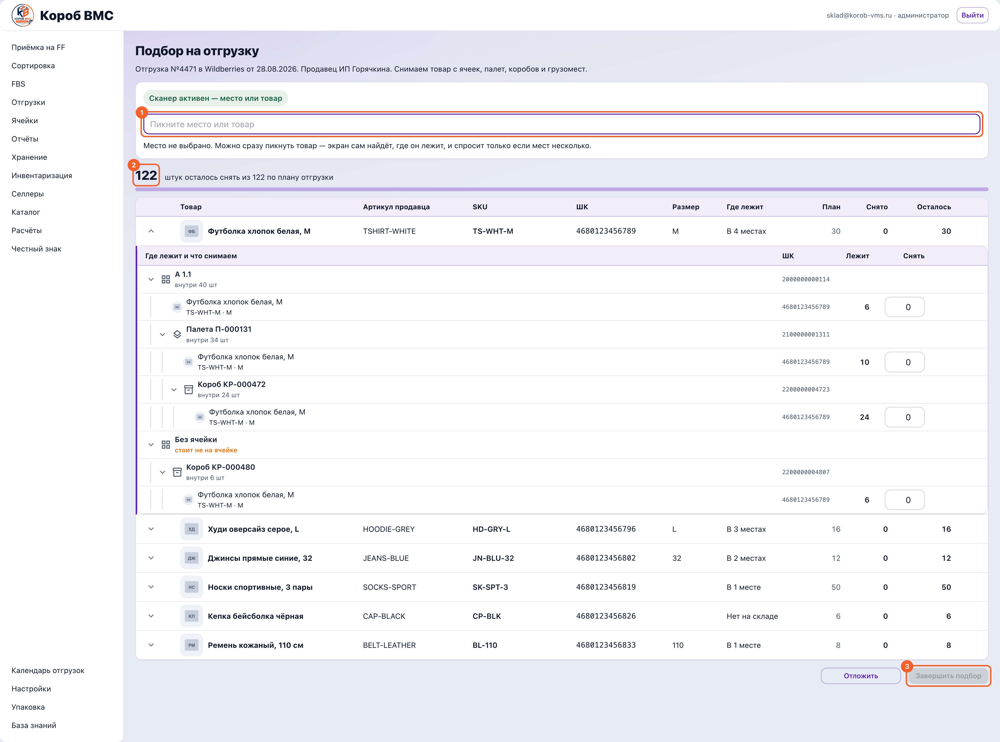

## Зачем это нужно

Отгрузка — это движение товара **от нас на маркетплейс**: мы увозим товар селлера на склад Wildberries или Ozon, и с этого момента продаёт его уже площадка со своего склада. Обратное движение, когда товар едет **от селлера к нам**, называется приёмкой, и это другой раздел и другая статья. Слово «поставка» для потока «селлер → фулфилмент» в системе не используется — чтобы никто не путал два встречных потока и не искал товар не в том документе.

Такая схема называется **ФБО** (в системе пишется латиницей — `FBO`): товар **заранее, партией** отгружается на склад маркетплейса, ещё до того, как его кто-то купил, и дальше площадка сама собирает и везёт заказы покупателям. Есть и встречная схема — **ФБС** (`FBS`): там товар остаётся лежать у нас на складе, а маркетплейс забирает его по факту заказа, то есть собираем мы **поштучно под конкретный уже оформленный заказ**. ФБС живёт в отдельном пункте меню «FBS» и описан отдельной статьёй; здесь речь только про ФБО и про обычную отгрузку со склада. Пока документ отгрузки не проведён, товар для системы никуда не уехал: он числится на складе, просто зарезервирован — то есть отложен под эту отгрузку и никому больше не отдастся.

## Шаг 1. Открыть отгрузки и завести документ

Отгрузка на маркетплейс (ФБО) начинается с документа: пока его нет, резервировать товар не под что.

Откройте в левом меню пункт **«Отгрузки»**. Экран называется «Отгрузки на МП», подпись под заголовком — «Документы отгрузки на маркетплейс: план товаров, упаковка, короба и отгрузка». В таблице колонки «Номер», «Плановая дата», «Создано», «Статус», «Селлер», «Доп.», «Строк», а сверху фильтр **«Селлер»** и **«Сортировка»** («Плановая дата ↓», «Плановая дата ↑», «Дата создания ↓», «Дата создания ↑»). Статусы идут по порядку работы: «Черновик» → «Утверждено» → «На сборке» → «Отгружено», плюс «Отменено» для брошенных. Нажатие на строку открывает документ на весь экран.

Новый документ заводится в блоке **«Новые документы»** сверху: выберите **«Селлер (ИП)»** и **«Маркетплейс»** (`Wildberries` или `Ozon`), нажмите **«Создать отгрузку на МП»**. Документ появится в статусе «Черновик» и сразу откроется. Зелёная плашка подтверждает создание одной из трёх фраз: для Ozon — «Отгрузка Ozon создана (черновик). Состав по строкам — на следующем этапе»; для WB, если склад ещё не подгрузился, — «...Выберите склад WB в документе, когда они подгрузятся»; для WB со сразу найденным складом — «Отгрузка на маркетплейс создана (черновик). Состав по строкам — на следующем этапе».

## Шаг 2. Заполнить шапку: дата и склад маркетплейса

Эти два поля — не бюрократия: без них кнопка «Утвердить» не оживёт, а значит, не будет ни резерва, ни задания на упаковку.

Заполните шапку документа: **«Дата отгрузки на МП»** — день, когда машина уезжает на площадку, — и **«Склад маркетплейса»**. Склады WB подтягиваются из кабинета селлера; пока их нет, в поле стоит «Не выбран» и система прямо пишет: «Можно создать черновик без склада WB. Для «Утвердить» нужно выбрать склад, когда он появится». У Ozon вместо выбора стоит пояснение: «Склад маркетплейса: Ozon определяет для конкретной поставки. Связь коробов с грузоместами и ТГМ заблокирована: кабинет недоступен» — и это не формальность, см. предупреждение ниже.

> **Ozon сейчас не доводится до конца.** Кабинет Ozon у этого ФФ отключён самим Ozon (код ошибки 403/7), и это сказывается на всём цикле, а не только на последнем шаге. Кнопка «Утвердить» у Ozon-отгрузки не активируется вообще — это известный дефект фронта (условие смотрит на склад WB, которого у Ozon в принципе не бывает), а не то, что нужно донастроить. Даже если бы «Утвердить» заработала, «Завершить» на кабинет Ozon ответит отказом при каждой попытке — это не «иногда, если кабинет недоступен», а гарантированно, потому что интеграция сейчас жёстко подключена к заглушке с фиксированным отказом. Если вам нужна отгрузка на Ozon прямо сейчас — это отдельная задача для разработчиков, а не то, что можно обойти в интерфейсе.

## Шаг 3. Набрать состав

Состав правится только в черновике — после утверждения план заморожен, и это сделано нарочно: по нему уже зарезервирован товар.

Наберите состав на вкладке **«Товары»**. Кнопка **«Добавить товары»** открывает окно «Выбор товаров» с поиском по артикулу, ШК (штрихкоду), артикулу WB и названию; там есть колонка **«Доступно FBO»** — сколько штук реально свободно на складе под такую отгрузку, — поле **«Кол-во в отгрузку»** и кнопка **«Добавить в отгрузку»**. Поштучно строка добавляется полем **«Штрихкод / артикул»** и кнопкой **«Добавить по ШК»**, а в черновике работает и сканер: каждый скан — плюс одна штука. Состав правится **только в черновике**: после утверждения экран честно пишет «Состав можно менять только в черновике — план уже утверждён».

## Шаг 4. Утвердить план

Нажмите **«Утвердить»**. Кнопка оживает, только когда указаны дата отгрузки, склад маркетплейса и есть хотя бы одна строка. По нажатию система проверяет свободный остаток по каждой строке, **резервирует** товар под эту отгрузку (он перестаёт быть доступным для ФБС и других документов), переводит документ в «Утверждено» и **сама создаёт задание на упаковку**.

## Шаг 5. Подобрать товар с полок

Это единственный шаг, где товар физически двигается: снятое сразу уходит с ячейки, а не «отмечается на потом».

Перейдите на вкладку **«Подбор»** — она разблокируется только после утверждения, до этого при наведении показывает причину «Утвердите план поставки, чтобы открыть подбор». Здесь вы физически снимаете товар с полок: наверху крупно написано, сколько «штук осталось снять из … по плану отгрузки», под ним полоса выполнения.

Работайте сканером в одном поле. Порядок удобный, но не жёсткий: можно сначала пикнуть ячейку или тару — сверху появится «Снимаем с: …», а подсказка сменится на «пикните товар, который снимаете», — а можно сразу пикнуть товар, и экран сам найдёт, где он лежит, и переспросит, только если мест несколько. Каждый скан товара — минус одна штука с места и плюс одна в колонку «Снято». Колонки таблицы: «Товар», «Артикул продавца», «SKU», «ШК», «Размер», «Где лежит», «План», «Снято», «Осталось». Ошиблись — у строки есть кнопка отмены последнего снятия, и товар вернётся ровно в то место, откуда его сняли.

Нажмите **«Завершить подбор»**. Пока план выбран не весь, кнопка объясняет блокировку подсказкой «Собран не весь план отгрузки»; соседняя **«Отложить»** просто выходит из подбора, ничего не теряя. После завершения экран сам переводит вас на «Упаковку».

## Шаг 6. Упаковать и разложить по коробам

Фактом отгрузки система считает содержимое коробов, а не то, что снято с полок. Поэтому короба — не формальность на конце, а то, по чему считают.

На вкладке **«Упаковка»** распечатайте бумагу кнопкой **«Печать накладной»** — выйдет «Лист отгрузки» на A4: фото, товар, инструкции по упаковке, колонка «Кол-во» с планом и пустая колонка «Факт» под ручной пересчёт. По этому листу товар и упаковывают.

Заведите тару в блоке **«Короба»** на той же вкладке. Блок свёрнут, но в заголовке уже видно «Коробов: N» и «Единиц: N». Пустые короба создают полем **«Кол-во коробов»** (от 1 до 50), выбором **«Пресет»** (`60×40×40` или `30×20×30`) и кнопкой **«Создать короб»** / **«Создать короба»**. Короб, собранный раньше, привязывается сканом в поле **«Штрихкод готового короба (WHB-…)»** и кнопкой **«Привязать»**: система переспросит «Добавить готовый короб?» и предупредит, что «весь короб будет добавлен в отгрузку со всем содержимым». Кнопка **«Загрузить по накладной»** принимает файл Excel (.xlsx), где каждый адрес — отдельный короб.

Наполняйте короба кнопкой **«Наполнить»**. В окне «Наполнить короб» выбирается **«Ячейка»**, есть поле скана с кнопкой **«Скан»**, а таблица показывает «План», «В коробах», «Доступно» и «Кол-во»; каждое добавление подтверждается всплывающим «Добавлено N шт». Этикетку на короб печатает кнопка **«ШК»** — откроется «Печать штрихкода короба» с выбором размера этикетки (по умолчанию 58×40 мм) и кнопкой **«Печать»**. Если в коробе оказалось больше товара, чем осталось по плану (например, короб уже был собран с запасом), система не откажет молча, а покажет окно **«Больше, чем в плане»** с кнопкой **«Добавить всё»** — решайте по факту, а не подгоняйте короб под план.

Когда весь товар упакован и разложен по коробам, нажмите зелёную **«Завершить упаковку»**. Если кнопка серая, подсказка объяснит: «Завершение станет доступно после печати обязательных ЧЗ/ШК и упаковки всего товара по плану» (ЧЗ — «Честный знак», обязательная маркировка, у части товаров печатается отдельно).

## Шаг 7. Провести отгрузку

Проведение списывает товар со склада, снимает резерв и отправляет услугу отгрузки в расчёты с селлером. Отменить это одним нажатием уже нельзя.

Проведите отгрузку кнопкой **«Завершить»** внизу документа. На промежуточных шагах вместо неё стоит большая кнопка **«Далее: Подбор»** или **«Далее: Упаковка»**, и она же под собой пишет, чего не хватает для перехода. «Завершить» требует, чтобы упаковка была закончена и товар лежал в коробах: **фактом отгрузки система считает именно содержимое коробов**, а не то, что снято с полок.

Если факт по коробам разошёлся с планом, появится окно **«Есть расхождения, точно провести?»** с числами «Распределено по коробам X из Y по плану». Посмотрите на цифры ещё раз: подтверждать расхождение стоит, только когда вы действительно везёте меньше. После проведения статус станет **«Отгружено»**, товар спишется со склада, резерв снимется, услуга отгрузки уйдёт в расчёты с селлером, строки с расхождением подсветятся красным, а пустые короба удалятся сами.

Если отгрузка сорвалась, нажмите **«Отменить отгрузку»**. Система переспросит и честно предупредит: «Товар из коробов вернётся на сортировку — его нужно будет заново распределить по ячейкам или использовать в других документах». Документ уйдёт в статус «Отменено».

## Шаг 8. Обычная отгрузка со склада (без маркетплейса)

Отдельный сценарий: товар уезжает не на площадку, а забирает его сам селлер, или уходит возврат, или идёт переезд на другой склад.

Обычная (операционная) отгрузка — это когда товар уезжает со склада **не на маркетплейс**: забирает сам селлер, уходит возврат, переезд на другой склад. Отдельного пункта в левом меню у неё нет: экран открывается по адресу `/app/ops/outbound` и доступен только администратору фулфилмента. Называется он «Отгрузка», подзаголовок — «Заявки → строки → подбор → списание». Учтите сразу: статусы здесь показаны техническими кодами — `draft` (черновик), `submitted` (в работе), `posted` (проведена).

Нажмите **«Новая заявка на отгрузку»** в блоке «Заявки на отгрузку», затем выберите её в списке слева — справа откроются «Детали отгрузки». Состав набирается формой ниже: **«Товар»**, **«Количество, шт»**, при желании сразу **«Ячейка (можно позже)»**, и кнопка **«Добавить строку»**. В одной заявке едет товар только одного селлера — смешивать нельзя, остатки и расчёты ведутся по каждому селлеру отдельно. Лишнюю строку убирает **«Удалить строку»**.

Назначьте каждой строке **«Ячейка отбора»** и нажмите **«Сохранить ячейку»** — без ячейки система не поймёт, откуда списывать товар. Кнопка **«Печать накладной»** выдаёт лист «Накладная — отгрузка со склада» с планом, уже отгруженным количеством и ячейками отбора.

Нажмите **«Отправить заявку»** — товар зарезервируется, заявка перейдёт в `submitted`, и появится блок **«Строки в работе»**.

Отгружайте по факту: у каждой строки есть поле **«Отгрузить, шт»** и кнопка **«Отгрузить»**, так что строку можно закрывать частями, по мере того как товар реально уезжает; когда всё увезли, кнопка **«Провести весь остаток»** списывает неотгруженное разом. Как только по всем строкам отгружено столько же, сколько в плане, заявка сама переходит в `posted`, а в блоке **«Движения по отгрузке»** внизу видно каждое списание со склада. Селлер в своём кабинете эти строки только смотрит — надпись «Отгрузку ведёт фулфилмент; доступен просмотр строк и статуса» стоит там намеренно.

> Отгрузку с проставленной плановой датой видно в пункте меню **«Календарь отгрузок»**: месяц, плитки по дням, на плитке — направление и подпись вида «N коробов · MP» для отгрузки на маркетплейс или «· FBO» для обычной. Клик по плитке открывает сам документ.

## Частые ошибки и что делать

- **Кнопка «Утвердить» серая.** Не хватает одного из трёх: даты отгрузки, склада маркетплейса или хотя бы одной строки товара. Проверьте шапку — чаще всего пустой остаётся «Дата отгрузки на МП» либо «Склад маркетплейса» стоит в положении «Не выбран». Если складов WB в списке нет вообще, они ещё не подгрузились из кабинета селлера, и утвердить документ пока не выйдет.
- **Вкладка «Подбор» или «Упаковка» серая и не нажимается.** Это не поломка, а порядок шагов. Наведите мышь — экран напишет причину: «Утвердите план поставки, чтобы открыть подбор» или «Подберите ещё N шт., чтобы перейти к упаковке». Назад по вкладкам ходить можно всегда, вперёд — только когда предыдущий шаг закрыт.
- **В окне «Выбор товаров» пусто или система пишет «Недостаточно свободного FBO остатка».** Товар может физически лежать на складе, но быть уже занятым: зарезервированным под другую отгрузку или отданным в ФБС-пул. Второй частый случай — отгрузка создана не на том складе; тогда в пустом списке прямо написано, на каком складе искали, и совет проверить, тот ли склад указан в отгрузке. Уменьшите количество или освободите резерв.
- **Короб не привязывается к отгрузке.** Поле «Штрихкод готового короба» понимает только штрихкоды тары, начинающиеся с `WHB-` или `INB-`; на товар и ячейку оно отвечает «На этой строке сканируют только готовый короб (WHB-…). Для ячейки или товара откройте «Добавить товары» у короба.» — эта подсказка называет кнопку немного не так, как она подписана на экране: ищите кнопку **«Наполнить»** у нужного короба и сканируйте в её собственное поле. Сообщения «Этот короб уже привязан к другой отгрузке» и «Короб создан на другом складе» означают ровно то, что написано: один короб не может ехать в двух документах, а чужой склад в этот документ не встанет — соберите товар в новый короб.
- **Нажали «Завершить», а отгрузка не проводится.** Читайте сообщение. «Завершите упаковку перед отгрузкой» — не нажата зелёная «Завершить упаковку». Сообщение про распределение количества означает другое: короба пустые. Помните, что фактом отгрузки считается содержимое коробов, а не подобранное с полок, — снятый, но не уложенный в короб товар для проведения не годится.
- **Пустой или лишний короб не удаляется.** Кнопки удаления короба и изъятия товара из короба включаются только в черновике, а сами короба появляются на экране уже после утверждения плана — поэтому в работе их не видно. Просто не наполняйте лишний короб: при проведении отгрузки пустые короба удаляются автоматически.
- **Отгрузки нет в «Календаре отгрузок».** В календарь попадают документы со статусом «Запланировано» и проставленной плановой датой — утверждённая отгрузка, которая уже в работе, там не показывается. Ищите её в списке раздела «Отгрузки», а не в календаре.
- **Ozon отказывает: «Передача в Ozon заблокирована: кабинет Ozon недоступен».** См. предупреждение в начале статьи — сейчас это происходит не иногда, а при каждой попытке, и до «Завершить» с Ozon дело обычно не доходит вовсе: «Утвердить» не активируется раньше. Важное успокоение из того же сообщения: «Документ и остатки не изменены» — товар не списался, переделывать ничего не нужно.
