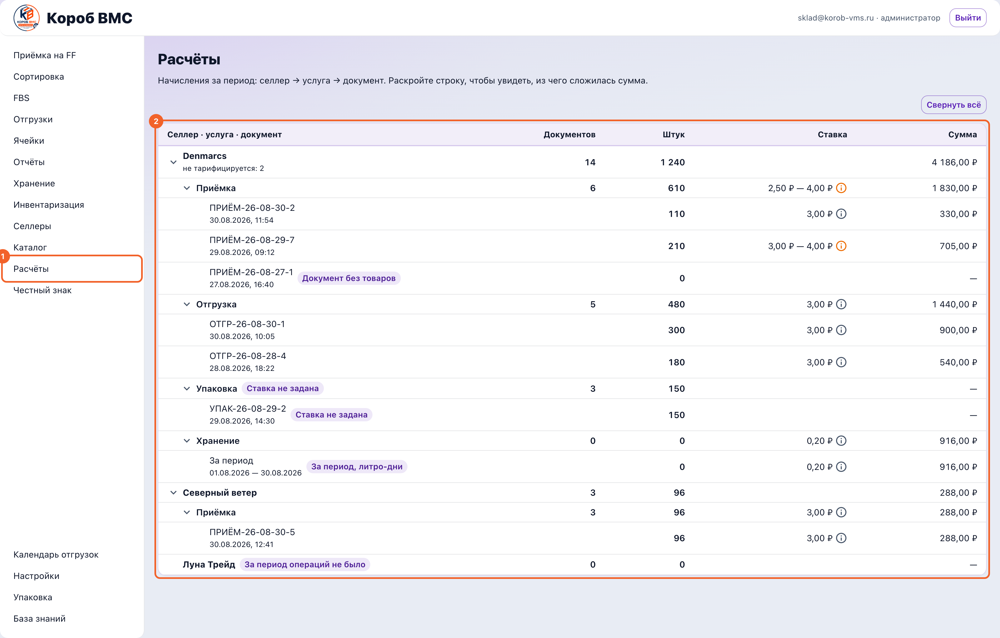
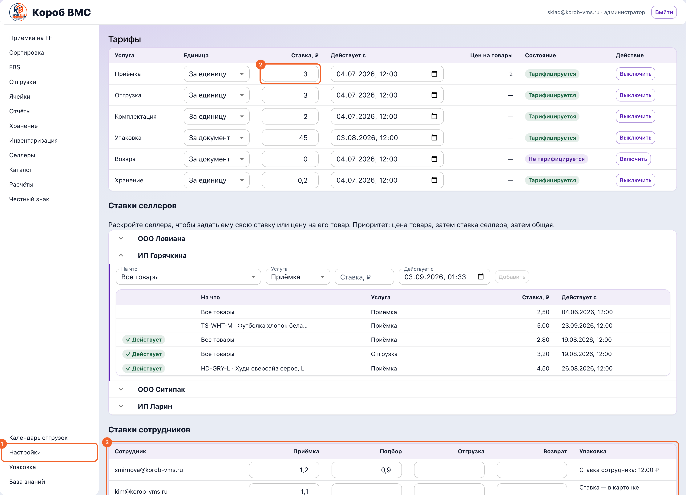

## Зачем это нужно

Раздел «Расчёты» отвечает на один вопрос: сколько склад наработал за выбранный период по каждому селлеру и на какую сумму ему выставлять счёт. Тут всё держится на трёх словах. **Ставка** (её же называют тарифом) — цена одной единицы услуги: рубли за документ, за штуку, за литр-день хранения. **Начисление** — запись «по этому документу селлеру насчитано столько-то»; она появляется в момент, когда операция завершена, и запоминает ту ставку, которая действовала именно тогда. **Счёт** — документ на оплату, собранный из начислений за период. Считаем в рублях, сутки и даты московские, НДС в этой версии продукта не считается вовсе.

Важно понимать, что «Расчёты» ничего не придумывают. Они показывают уже записанные факты работы склада — приёмки, отгрузки, упаковки, возвраты — плюс хранение, посчитанное по остаткам за те же дни. Поэтому дыры в тарифах видно прямо здесь, в двух колонках-счётчиках, и закрывать их нужно до того, как счёт уйдёт селлеру: документ, у которого нет суммы, в счёт не попадёт, и склад просто не получит за него деньги. И наоборот — ставка, заведённая сегодня, не пересчитает вчерашние начисления: они уже записаны с той ценой, которая была на момент операции.

## Шаг 1. Открыть «Расчёты» и задать период

Экран показывает уже записанные факты работы склада за выбранные даты. Ничего не досчитывается задним числом — поэтому сначала период, потом всё остальное.

Откройте в левом меню пункт **«Расчёты»**. Экран называется «Расчёты», подзаголовок — «Начисления за работу склада и счета селлерам за выбранный период». Пункт меню и сам экран доступны только администратору фулфилмента: если пункта нет, это права, а не поломка.

Убедитесь, что вы на вкладке **«Селлеры»** — на ней живут начисления. Соседняя вкладка **«Выставленные счета»** — это история уже выписанных счетов, к ней вернёмся в конце.

Задайте «Период» в полях «с» и «по» либо нажмите готовую кнопку: **«Сегодня»**, **«7 дней»**, **«30 дней»**, **«Этот месяц»** или **«Прошлый месяц»**. «7 дней» и «30 дней» считаются включительно с сегодняшним днём, «Прошлый месяц» берёт прошлый календарный месяц целиком. Будущие даты не принимаются, а период длиннее 366 дней подсвечивается ошибкой «Период превышает допустимую длину».

Включите переключатель **«Финансы»**, если работаете с деньгами. Без него экран показывает только натуральные показатели — документы и штуки. С ним появляются колонка «Стоимость услуг», колонка «Нет ставки», ставки и суммы внутри раскрывашки и кнопка **«Выставить счёт»**. Положение переключателя запоминается в браузере под вашей учётной записью, так что в следующий раз экран откроется в том же виде.

При необходимости сузьте список выпадающим «Селлер» — по умолчанию там «Все селлеры».

Посмотрите на плитки над таблицей: «Селлеров», «Документов», «Штук» и, при включённых «Финансах», «Стоимость услуг». Это итог по всему, что попало в период, а не по одной строке.

## Шаг 2. Прочитать таблицу и две колонки-счётчика

Здесь прячется главная ошибка раздела: «Не тарифицируется» и «Нет ставки» выглядят похоже, а означают прямо противоположное.

Прочитайте таблицу: «Селлер», «Документов», «Штук», «Стоимость услуг», «Не тарифицируется», «Нет ставки». «Стоимость услуг» — это сумма начислений за период за вычетом сторно (сторно — отменяющая запись с минусовой суммой, она появляется, когда операцию откатили). Строки, у которых суммы нет, в эту цифру не входят вообще.

Разберитесь с колонкой **«Не тарифицируется»**. В неё попадают документы, у которых в системе не проставлена платная услуга: работа склада зафиксирована, но превращать её в деньги система не должна. Это свойство самого документа, а не настроек: сколько ставок ни заводи, счётчик не изменится и сумма не появится. В раскрывашке такая строка помечена нейтральным (фиолетовым) ярлыком «Не тарифицируется», а галочка выбора у неё погашена с подсказкой «Документ не тарифицируется».

Теперь колонка **«Нет ставки»** — она появляется только вместе с «Финансами» и означает совсем другое. Услуга у документа есть, деньги за неё брать положено, но суммы нет: либо к документу вообще не привязалось начисление, либо начисление есть, а денег в нём нет — на дату операции не действовала ни одна подходящая ставка. Это чинится тарифом, и чинить нужно: такие строки не входят в «Стоимость услуг» и в счёт их не включить. В раскрывашке у них жёлтый ярлык «Нет ставки», а подсказка у галочки прямо говорит: «Нет ставки — задайте тариф в настройках».

## Шаг 3. Раскрыть селлера и разобрать документы

В раскрывашке видно, из чего сложилась сумма, и откуда взялась каждая строка: ссылка «Открыть» ведёт в исходный документ.

Раскройте строку селлера стрелкой слева — под ней откроется список документов за период: «Дата», «Документ», «Услуга», «Количество», «Результат», а при включённых «Финансах» ещё «Ставка», «Сумма» и «Счёт выставлялся»; крайняя правая колонка — «Источник». В колонке «Результат» бывает четыре значения: «Выполнено», «Сторно», «Не тарифицируется» и «Нет ставки». Ссылка **«Открыть»** в колонке «Источник» ведёт в исходный документ — приёмку или отгрузку. Показывается по 50 документов; если их больше, внизу появится кнопка **«Загрузить ещё»**.

Обратите внимание на первую строку раскрывашки — строку хранения. У неё в колонке «Документ» написано «За период», услуга — «Хранение», количество — число с подписью «л·дн» (литро-дни), а результат — «Рассчитано» или «Нет габаритов». Это не документ склада, а расчёт за весь выбранный период, который система делает заново каждый раз, когда вы открываете строку.

## Шаг 4. Понять, как считается хранение

Хранение — единственная строка, которую считают не по документу, а по времени: сколько объёма и сколько суток пролежало на складе.

Поймите, как считается хранение. Мера — **литр-день**: один литр объёма, пролежавший на складе одни сутки. Объём одной штуки берётся из габаритов товара (длина × ширина × высота; на экране «Хранение» при вводе в сантиметрах объём считается как Д × Ш × В ÷ 1000) либо из объёма тары, если габариты товара мерить нечем. Дальше система идёт по истории движений остатка: сколько штук лежало, столько времени они лежали. Пример: 10 штук по 6 литров пролежали ровно трое суток — это 10 × 6 × 3 = 180 литро-дней; при ставке 0,50 ₽ за литр-день выйдет 90 ₽. Сутки считаются по-московски, время учитывается дробно (товар, приехавший в обед, даёт полдня, а не целый), и на каждый день берётся та ставка, которая действовала в этот день.

Ставку хранения задают в разделе **«Хранение»** кнопкой **«Задать тариф»** (если тарифа ещё нет) или **«Изменить тариф»**. В окне «Тариф хранения» заполняются «Ставка, ₽/л·день» и «Дата начала», причём дата не может быть в прошлом, а ставка меньше копейки не сохранится — экран скажет «Минимальная сохраняемая ставка — 0,01 ₽/л·день». Там же раскрывается блок «Индивидуальная ставка селлера» — своя цена для одного селлера, она перебивает общую. Кнопка видна только администратору фулфилмента, а сохранённая ставка попадает в ту же матрицу тарифов, из которой считаются «Расчёты».

## Шаг 5. Задать ставки

Ставка, заведённая сегодня, не пересчитает вчерашние начисления: они уже записаны с той ценой, которая действовала на момент операции. Поэтому дыры закрывают до конца периода, а не после.

Ставки по остальным услугам и все персональные ставки селлеров живут в разделе **«Настройки»**, в блоке «Тарифы» внизу экрана (тоже только для администратора фулфилмента). Верхняя таблица — общие ставки: «Услуга», «Единица» («За единицу» или «За документ»), «Ставка, ₽», «Действует с», «Цен на товары» (сколько персональных цен на конкретные товары заведено по этой услуге), «Состояние» и кнопка **«Выключить»** / **«Включить»**. Ставка задаётся в рублях, не больше 21 474 836,47 ₽ и с двумя знаками после запятой.

Чтобы завести цену конкретному селлеру, откройте в том же блоке «Ставки селлеров», раскройте нужного селлера и заполните форму: «На что» («Все товары» — это ставка самого селлера, либо конкретный товар — цена на товар), «Услуга», «Ставка, ₽», «Действует с», затем **«Добавить»**. Приоритет при расчёте такой: цена товара перебивает ставку селлера, ставка селлера перебивает общую; у кого своей нет, тот считается по общей — заводить её отдельно не нужно. Цену на конкретный товар система примет только у услуги, которая считается «За единицу». В списке ставок селлера действующая помечена ярлыком «✓ Действует», остальные строки — это история и будущие версии, которые ещё не вступили в силу. Всё, что вы поменяли в блоке «Тарифы», сохраняется одной кнопкой **«Сохранить матрицу»**.

## Шаг 6. Собрать и выставить счёт

Вернитесь в «Расчёты», раскройте селлера при включённых «Финансах», отметьте галочками нужные строки (и строку хранения, если её тоже включаете в счёт) и нажмите **«Выставить счёт»**. Откроется «Предпросмотр счёта»: строки сгруппированы по услугам, хранение идёт отдельной строкой «Хранение товара за выбранный период», внизу «Итого». Пока вы не нажали **«Сохранить»**, счёта не существует — предпросмотр показывает ровно тот документ, который будет сохранён.

Если галочек не поставить, та же кнопка **«Выставить счёт»** откроет окно «Ручной счёт»: выбираете «Плательщик», заполняете строки «Услуга» и «Сумма» (до десяти строк, кнопка **«Добавить строку»**) и жмёте **«Предпросмотр»**. Помните предупреждение в самом окне: ручной счёт не отмечает складские операции выставленными, связи с ними у него нет.

После **«Сохранить»** в заголовке окна появятся номер счёта и слово «выставлен», а сам счёт встанет на вкладку **«Выставленные счета»** — там он ищется по номеру, фильтруется по селлеру и статусу, а в карточке видно «Получатель», «Плательщик», строки и итог. Оттуда же его печатают кнопкой **«Печать счёт»** и, если ошиблись, отменяют кнопкой **«Отменить счёт»** с подтверждением. Отмена необратима: счёт останется в истории со статусом «Отменён».

Какие услуги вообще тарифицируются и в чём меряются, удобно держать в голове одной таблицей:

| Услуга | Единица | Где задаётся ставка |
|---|---|---|
| Приёмка | За единицу или за документ | Настройки, блок «Тарифы» |
| Отгрузка | За единицу или за документ | Настройки, блок «Тарифы» |
| Упаковка | За единицу или за документ | Настройки, блок «Тарифы» |
| Возврат | За единицу или за документ | Настройки, блок «Тарифы» |
| Хранение | Только за литр-день | Раздел «Хранение» или блок «Тарифы» |

> Отдельно стоит блок «Ставки сотрудников» в том же разделе «Тарифы». Это оплата труда работников склада, а не цена для селлера: на счета селлерам эти ставки не влияют и в «Расчётах» не участвуют.

## Частые ошибки и что делать

- **Завели ставку, а документы всё равно в колонке «Нет ставки».** Ставка действует с даты, указанной в поле «Действует с», и задним числом ничего не пересчитывает: у каждого начисления цена зафиксирована на момент операции. Сверьте дату начала ставки с датой документа в раскрывашке. Если период уже прошёл, а денег за него нет, выставить их селлеру можно только ручным счётом — он собирается из строк, которые вы вписываете сами.
- **Пытаются вылечить тарифом колонку «Не тарифицируется».** Не выйдет: у этих документов вообще нет платной услуги, ставка тут ни при чём. Если такие документы должны стоить денег, вопрос не к экрану «Расчёты», а к настройке того процесса, который их порождает — идите к администратору, а не заводите ставки наугад.
- **Галочка у строки серая, и непонятно почему.** Наведите на неё курсор — причина написана словами: «Документ ещё не начислен — счёт собирается из начислений», «Нет ставки — задайте тариф в настройках», «Документ не тарифицируется» или «Сторно попадёт в счёт вместе со своим начислением». Последнее — не ошибка: сторно всегда уходит в счёт в паре со своим начислением, отдельно его выставить нельзя.
- **Строку хранения не выбрать: «Нет габаритов у товара — хранение в счёт не включить».** Значит, хотя бы у одного товара селлера нет объёма, и посчитать литро-дни честно нельзя. Идите в раздел **«Хранение»**, найдите строки со статусом «Нет габаритов», нажмите **«Внести обмер»** и заполните либо «Габариты товара» (длина, ширина, высота в сантиметрах), либо «Объём тары» с комментарием, а затем пересчитайте месяц кнопкой **«Сформировать за месяц»**.
- **При сохранении счёта: «Расчёт хранения устарел, пока счёт собирался».** Сервер пересчитывает хранение заново и не верит цифре из браузера — за время сборки счёта что-то изменилось (движение остатка, габариты, ставка). Обновите отчёт, заново отметьте строку хранения и соберите счёт ещё раз. Сообщение «Счёт изменился с момента предпросмотра. Соберите его заново» лечится так же.
- **Ручным счётом закрыли то, что уже было в обычном счёте.** Ручной счёт ни с чем не связан и не помечает операции выставленными, поэтому одну и ту же работу легко выставить к оплате дважды. Перед ручным счётом посмотрите в раскрывашке колонку «Счёт выставлялся»: «✓» с числом означает, что начисление уже попадало в счета.
- **При сохранении тарифов: «Конфигурация тарифов уже изменилась. Обновите данные и повторите сохранение».** Кто-то сохранил матрицу параллельно с вами, и ваша версия устарела. Перезагрузите экран настроек, внесите правку заново и сохраните — иначе вы затрёте чужую ставку.
- **В строке «Хранение» поменяли «Единица» — и сохранение падает с непонятным кодом.** У хранения единица только одна, литр-день, и других значений система не принимает. Не трогайте у него поле «Единица», меняйте только ставку и дату начала.
